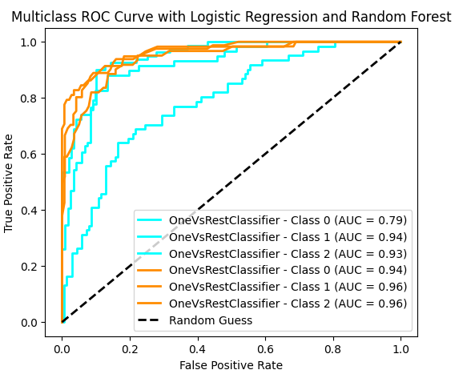

```{r}
library(tidyverse)
library(mice)
```

```{r}
data = read.csv("G:/My Drive/Master-Data-Science/Semester_1/Business_Analytics/Data/index.csv", header=T)
str(data)
```

```{r}
unique(data$No.of.Credits.at.this.Bank)
```

```{r}
table(data$Purpose)/1000*100
```

```{r}
data$Creditability = as.factor(data$Creditability)
data$Account.Balance <- replace(data$Account.Balance, data$Account.Balance==4, 3)
data$Account.Balance = factor(data$Account.Balance, levels = seq(1,3), labels = c('No Account', 'No balance','Some balance'))

data$Payment.Status.of.Previous.Credit[data$Payment.Status.of.Previous.Credit <=1] =1
data$Payment.Status.of.Previous.Credit[data$Payment.Status.of.Previous.Credit ==2] = 2 
data$Payment.Status.of.Previous.Credit[data$Payment.Status.of.Previous.Credit >=3] = 3
data$Payment.Status.of.Previous.Credit = factor(data$Payment.Status.of.Previous.Credit, levels = seq(1,3), labels = c('Some Problems','Paid Up','No Problems(in this bank)'))

data$Value.Savings.Stocks[data$Value.Savings.Stocks == 4] = 3
data$Value.Savings.Stocks[data$Value.Savings.Stocks == 5] = 4
data$Value.Savings.Stocks = factor(data$Value.Savings.Stocks, levels = seq(1,4), labels = c('None','Below 100 DM','[100, 1000)','Above 1000 DM'))

data$Length.of.current.employment[data$Length.of.current.employment == 2] = 1
data$Length.of.current.employment[data$Length.of.current.employment == 3] = 2
data$Length.of.current.employment[data$Length.of.current.employment == 4] = 3
data$Length.of.current.employment[data$Length.of.current.employment == 5] = 4
data$Length.of.current.employment = factor(data$Length.of.current.employment, levels = seq(1,4), labels = c('Below 1 year (including unemployed)','[1,4)','[4,7)','Above 7'))

data$Sex...Marital.Status[data$Sex...Marital.Status <=2] = 1
data$Sex...Marital.Status[data$Sex...Marital.Status ==3] = 2
data$Sex...Marital.Status[data$Sex...Marital.Status ==4] = 3
data$Sex...Marital.Status = factor(data$Sex...Marital.Status, levels = seq(1,3), labels = c('Male Divorces/Single','Male Married/Widowed','Female'))

data$No.of.Credits.at.this.Bank[data$No.of.Credits.at.this.Bank >= 3] = 2
data$No.of.Credits.at.this.Bank = factor(data$No.of.Credits.at.this.Bank, levels = seq(1,2), labels = c('1','More than 1'))

data$Guarantors[data$Guarantors >= 2] = 2
data$Guarantors = factor(data$Guarantors, levels = seq(1,2), labels = c('None','Yes'))

data$Concurrent.Credits[data$Concurrent.Credits <=2] = 1
data$Concurrent.Credits[data$Concurrent.Credits ==3] = 2
data$Concurrent.Credits = factor(data$Concurrent.Credits, levels = seq(1,2), labels = c('Other Banks or Dept Stores','None'))

data = data[-21]

data$Purpose[data$Purpose ==1] = 1
data$Purpose[data$Purpose ==2] = 2
data$Purpose[data$Purpose %in% c(3,4,5,6)] = 3
data$Purpose[data$Purpose %in% c(8,9,10,0)] = 4
data$Purpose = factor(data$Purpose, levels = seq(1,4), labels = c('New Car','Used Car','Home Related','Other'))
```

```{r}
md.pattern(data)
```

```{r}
str(data)

```

# Statistical Testing

Chi-square for

```{r}
Categorical.Table = data.frame(
    'Variable' = character(),
  'p-value' = numeric()
)
  
for (i in colnames(data[,-c(1,3,6,14)])){
  test = chisq.test(table(data$Creditability,data[,i]))
  test2 = data.frame(i,test$p.value)
  Categorical.Table = rbind(Categorical.Table, test2)
}
Categorical.Table
```

# Train test split

```{r}
indexes = sample(1:1000, size = 500)
Train = data[indexes,]
Test = data[-indexes,]

```

# Logistic Regression

generalized linear model = glm()

-   when y is discrete/binary

$$
H_0~:~B_j =0 \newline
H_1:B_j \not=0
$$

## Create initial model

```{r}
logisticmodel50 = glm(Creditability~Account.Balance+Payment.Status.of.Previous.Credit+Purpose+Value.Savings.Stocks+Length.of.current.employment+Sex...Marital.Status+Most.valuable.available.asset+Type.of.apartment+Concurrent.Credits+Duration.in.Current.address+Credit.Amount+Age..years., family='binomial',data=Train)
summary(logisticmodel50)
```

## Optimize model

```{r}
logisticmodel50final = glm(Creditability~Account.Balance + Payment.Status.of.Previous.Credit + Purpose + Length.of.current.employment + Sex...Marital.Status, data=Train, family = 'binomial' )
summary(logisticmodel50final)
```

## Obtain fitted values

```{r}
fit50 = fitted.values(logisticmodel50final)
head(fit50)
```

## Change binary response

```{r}
thres = rep(0,500)
for (i in 1:500) {
  if(fit50[i]>0.5) {
    thres[i] = 1
  }
  else {
    thres[i] = 0
  }
}
str(thres)
str(Train$Creditability)
```

## Create cross table

```{r}
conf.mat = table(Train$Creditability, thres)
conf.mat
```

## Compute accuracy

```{r}
LR_train_acc = sum(diag(conf.mat))/500*100
```

## Perform on testing data

print(sum(diag(ct)))

```{r}
library(gmodels)
# Perform modeling on testing data
prr = predict(logisticmodel50final, data=Test,type='response')

# Set threshold
thres_pred=rep(0,500)
for (i in 1:500) {
  if(prr[i]>0.5) {
    thres_pred[i] = 1
  }
  else {
    thres_pred[i] = 0
  }
}
str(thres_pred)

ct = CrossTable(Test$Creditability, thres_pred, digits=1, prop.r=F, prop.t=F,prop.chisq = F, chisq = F)
print(ct)

conf.mat2 = table(Test$Creditability, thres_pred)
LR_test_acc = sum(diag(conf.mat2))/500*100
```

## Plot ROC AUC Curve



```{r}
library(ROCR)


par(mfrow=c(1,2))
#Training Data
prod_pred = prediction(fit50, Train$Creditability)
perf = performance(prod_pred,'tpr','fpr')
plot(perf, main='ROC-AUC Curve Training Data');abline(a = 0, b = 1, col = "red", lty = 2)

#Testing Data
prod_pred = prediction(prr, Test$Creditability)
perf = performance(prod_pred,'tpr','fpr')
plot(perf, main='ROC-AUC Curve Testing Data');abline(a = 0, b = 1, col = "red", lty = 2)


```

# Tree Based Index

Gini Index - recursive partition

## Model Building

```{r}
library(tree)

tree_model = tree(Creditability ~ Account.Balance+Duration.of.Credit..month.+Payment.Status.of.Previous.Credit+Purpose+Credit.Amount+Value.Savings.Stocks+Length.of.current.employment+Instalment.per.cent+Sex...Marital.Status+
Guarantors+Duration.in.Current.address+Most.valuable.available.asset+Age..years.+Concurrent.Credits+Type.of.apartment+No.of.Credits.at.this.Bank+Occupation+No.of.dependents+Telephone, data=Train, method="class")

```

```{r}
plot(tree_model);text(tree_model, pretty=0, cex=0.6)
```

### Evaluate Train Set

```{r}
train_pred = predict(tree_model,Train, type='class')
ct1 = table(Train$Creditability, train_pred)
T_Train_acc = sum(diag(ct1))/500*100

```

### Evaluate Test Set

```{r}
test_pred = predict(tree_model,Test, type='class')
ct2 = table(Train$Creditability, test_pred)
T_Test_acc = sum(diag(ct2))/500*100

```

### ROC AUC Curve

```{r}
# Training Data
fit_tree_train = predict(tree_model, data=Train)

prod_pred1 = prediction(fit_tree_train[,2], Train$Creditability)
perf1 = performance(prod_pred1,'tpr','fpr')


# Testing Data
fit_tree_test = predict(tree_model, data=Test)

prod_pred2 = prediction(fit_tree_test[,2], Test$Creditability)
perf2 = performance(prod_pred2,'tpr','fpr')

par(mfrow=c(1,2))
plot(perf1, main='ROC-AUC Curve Training Data');abline(a = 0, b = 1, col = "red", lty = 2)
plot(perf2, main='ROC-AUC Curve Testing Data');abline(a = 0, b = 1, col = "red", lty = 2)
```

## Pruning

```{r}
tree_model_prune = prune.misclass(tree_model, best=8)
```

### Evaluate Train Set

```{r}
train_prune_pred = predict(tree_model_prune,Train, type='class')
ct3 = table(Train$Creditability, train_prune_pred)
TP_Train_acc= sum(diag(ct3))/500*100
```

### Evaluate Test Set

```{r}
test_prune_pred = predict(tree_model_prune,Test, type='class')
ct4 = table(Train$Creditability, test_prune_pred)
TP_Test_acc = sum(diag(ct4))/500*100
```

### ROC AUC Curve

```{r}
# Train Dataset

fit_tree_prune_train = predict(tree_model_prune, data=Train)

prod_pred = prediction(fit_tree_prune_train[,2], Train$Creditability)
perf1 = performance(prod_pred,'tpr','fpr')


# Test Dataset
fit_tree_prune_test = predict(tree_model_prune, data=Test)

prod_pred = prediction(fit_tree_prune_test[,2], Test$Creditability)
perf2 = performance(prod_pred,'tpr','fpr')

par(mfrow=c(1,2))
plot(perf1, main='ROC-AUC Curve Training Data');abline(a = 0, b = 1, col = "red", lty = 2)
plot(perf2, main='ROC-AUC Curve Testing Data');abline(a = 0, b = 1, col = "red", lty = 2)


```

# Combine accuracy

```{r}
data.frame(
  Models = c('Logistic Regression','Tree','Tree Pruned'),
  Train = c(LR_train_acc,T_Train_acc,TP_Train_acc),
  Test = c(LR_test_acc,T_Test_acc,TP_Test_acc)
)
```
