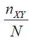
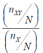
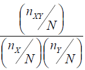

# Bahagian 1

## a) Terangkan objektif utama analisis faktor.

Factor analysis is one of the many methods of dimension reduction. It is used to reduce the number of variables into a more manageable and smaller size for better computing. It utilizes a technique that explains the covariance between multiple different existing variables into one (or more) *external* variables, also known as hidden factors. These hidden factors are under the impression that there are relations between pre-existing variables that can be explained by a hidden variable, but will still be able to reflect back to the original data. Thus, if analysis is done on the reduced dimension of the data by factor analysis, it can indirectly be inferred to the original data.

## b) Nyatakan peranan pemboleh ubah pendam dalam analisis faktor.

The hidden factors in the factor analysis plays a role in describing the relation between data of pre-existing (original) variables. As mentioned, the hidden factors that describe the relation between datapoints of pre-existing variables can often reduce the dimension of the original data. For example, if we have a dataset of cars which contain the variables describing different car models and brands using matrices such as horsepower, fuel consumption, weight, price, rim size, and others. We can perform factor analysis to see the relation between these pre-existing variables to denote a hidden factors within these variables. high horsepower, high fuel consumption, and low weight may describe a sports car. On the other hand, low horsepower, low fuel consumption, and low weight may describe a city car instead. Thus, sports car and city car are the *hidden factors* that describe the original data in much smaller dimension without sacrificing much of the variance in the original data. Subsequently successfully reducing the original dimension of the data frame from 5 variables, to 2 variables. This shows that the hidden variables obtained by factor analysis provides an opportunity to reduce the dimension of data, which is useful in large scale dimension data, into smaller size data without losing data quality. This is important in further down the line for further data exploration using algorithms where higher dimension data are computationally more expensive.

## c) Diberi set data FACars.csv yang menerangkan 14 atribut berkaitan skor keutamaan pelanggan bagi tingkahlaku pembelian kereta. Jalankan analisis faktor terhadap set data ini berdasarkan arahan-arahan berikut:

```{r, include=F}
library(tidyverse)
library(corrplot)
library(psych)
```

### i) Skalakan data bagi setiap atribut.

```{r}
data = read.csv('FACars.csv')
head(data)
```

```{r}
scaled_data = scale(data)
head(scaled_data)
```

### ii) Dapatkan matriks korelasi dan terangkan berkaitan struktur data.

```{r}
as.data.frame(cor(scaled_data))
corrplot(cor(scaled_data), order='hclust')
```

Based on the correlation matrix from above, it can be seen that most of the data between the variables are not highly correlated. Therefore, there are no data that can be explicitly and manually dropped from the dataset based on the correlation matrix to reduce the size of the dataset. Thus, factor analysis may play a role in reducing the dimension of this dataset.

```{r}
str(data)
```

The structure of the data is in the form of data frame. The data frame contains 14 variables, with 90 observations. All the variables are in integer form and none are mis-coded. Thus, all the variables can be used for the correlation matrix.

### iii) Tentukan bilangan pemboleh ubah pendam yang mungkin sesuai untuk menerangkan data dalam (i).

```{r}
scree(scaled_data)
```

Based on the screeplot above, using the elbow method a suitable component number to be reduced is 3.

### iv) Berdasarkan maklumat (iii), jalankan analisis faktor terhadap data dan huraikan berkaitan peratusan varians yang boleh diterangkan menerusi faktor-faktor yang diperolehi.

```{r}
FA3 = factanal(scaled_data, factors = 3, scores = 'regression',rotation = 'varimax')
FA3
```

Based on the factor analysis done on the data, it shows that 3 factors is sufficient reduction as the p-value\>0.05. However, the percentage of variance of the original data that can be explained by the 3 factors is only 33.3%. This means that during the process of reduction using factor analysis, 63% of the variance of the data from the original dataset is loss during the reduction process. As the number of factors is reduced, it is at the price of loosing the variance of the data from the original dataset.

### v) Berdasarkan keputusan dalam (iv), terangkan sama ada kaedah analisis faktor sesuai untuk menurunkan dimensi dalam dataset FACars.csv.

Based on the cumulative explained variance of 33.3%, although it can adequately reduce the data, a 33.3% of cummulative variance is a poor outcome. Too much valuable data is loss by this method of dimension reduction. Thus, factor analysis is not a good method of dimension reduction for this dataset.

# Bahagian 2

## a) Nyatakan objektif utama dalam analisis aturan sekutuan.

The main objective of the association rule is to look at the relation between sets of items. It is often being used in a 'market' situation where the aim or objective of the analysis is to look at the association between items that are selected. Often denoted as $P(Y|X)$, where $X$ is the item bought first, and $Y$ is the item bought after $X$. The association rule is to study the consequence and relation of items often grouped together and subsequent combinations and decisions.

## b) Terangkan kefahaman anda berkaitan tiga ukuran asas bagi suatu data Aturan Sekutuan, iaitu Sokongan, Keyakinan dan Lif.

Based on my understanding of the evaluation matrices for Association Rule which are; Support, Confidence, and Lift.

> 
>
> Support is the absolute measure of the occurrence of the rule. It reflects on the frequency of the itemset and shows how common the rule is. It is denoted by $P(X~\cap~Y)$ and the equation above, it shows that support is the rate of transactions containing both $X$ and $Y$ in the whole data. Thus, based on the above, it can be seen that it shows the occurrence of the rule in the dataset.

> 
>
> Confidence is the conditional probability of the rule. It reflects on the reliability occurrence of the rule and shows how strong the rule is. Denoted by $P(X~\cap~Y)/P(X)$ and the equation above, the confidence shows the rate of transaction that contains the item $Y$, given that the item $X$ is bought. Thus, based on the above, it can be seen that it shows the strength of the rule in terms of conditional probability of $Y$ given $X$ .

> 
>
> Lift can be interpreted relative to random chance. It is the measurement of the strength of the association and reflects on the rule's importance. Denoted by $P(X~\cap~Y)/(P(Y)P(X))$ and the equation above, it explains the rate of all the transactions that contain $Y$. Thus, based on the above, it can be seen that it shows the strength of the occurrence of the rule in the dataset.

## c) Diberi data transaksi pembelian barangan di suatu pasar raya seperti jadual berikut:

### i) Masukkan data rekod transaksi tersebut ke dalam R. 

```{r, include=F}
library(arules)
```

```{r}
data2 = read.transactions('data.csv', sep=',')
data2

```

### ii) Dapatkan senarai tiga barangan utama yang paling kerap dibeli.

```{r}
itemFrequencyPlot(data2, topN=9,
                  main='Susunan item mengikut kekerapan pembelian')
```

3 barang utama yang paling kerap dibeli adalah Gula, Lampin, dan Roti. Namun, Susu mempunyai *relative frequency* yang sama juga.

### iii) Adakah terdapat set aturan yang memenuhi nilai ambang sokongan 0.01?. Jika ada, dapatkan set aturan tersebut.

```{r}
Aturan = apriori(data2,
                 parameter = list(supp=0.01))
```

Ya, terdapat beberapa set aturan yang memenuhi nilai ambang sokongan 0.01.

```{r}
inspect(Aturan)
```
