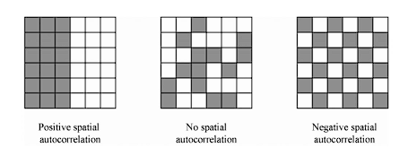

Data yang melibatkan ruang, lokasi dan geografi.

*Objek Reruang : spatial objects*

Contoh : set data vektor mungkin menerangkan maklumat tentang sempadan negara di dunia bersama sama dengan maklumat tentang saiz populasi

*Medan Reruang : spatial fields*

Contoh : aplikasi analisis reruang yang melibatkan data meteorologi, sains bumi, analisis imej dan lain lain. Jika data reruang dicerap bersama dengan maklumat masa, ianya dikenali sebagai analisis ruang masa

-   Data Meteorologi
-   Data objek bergerak
-   Data Sains Bumi
-   Data Wabak Penyakit
-   Data diagnostik penyakit
-   Data demografi

# Spatial Points / Data Titik

```{r}
load("G:/My Drive/Master-Data-Science/Semester_1/Data_Mining/Data/wst.RData")
wst
attach(wst)
library(sp)
library(raster)
names(wst)
```

## Takrifkan data reruang

```{r}
lonlat = cbind(longitude, latitude)
pts = SpatialPoints(lonlat)
pts
```

## Takrifkan CRS dalam data reruang

```{r}
crdref = CRS('+proj=longlat +datum=WGS84')

pts =SpatialPoints(lonlat, proj4string=crdref)
pts
```

## Masukkan maklumat p/ubah data yang diminati

```{r}
df = data.frame(ID = name, precip)
ptsdf = SpatialPointsDataFrame(pts, data=df)
ptsdf
```

## Plot Data

```{r}
plot(pts, axes=T)
```

## Lihat details data

```{r}
showDefault(ptsdf)
```

# Spatial Lines / Data Garis

```{r}
lon = c(-116.8, -114.2, -112.9, -111.9,-114.2,-115.4,-117.7)
lat = c(41.3,42.9,42.4,39.8,37.6,38.3,37.6)
```

```{r}
lonlat = cbind(lon,lat)
lns = spLines(lonlat, crs=crdref)
plot(lns,axes=T)
```

# Spatial Polygon / Data Poligon

```{r}
pols = spPolygons(lonlat, crs=crdref)
plot(pols, axes=T)
```

# Data Raster

```{r}
r=raster(ncol=20,nrow=20, xmx=-80,xmn=-150, ymn=20, ymx=60)

x = rexp(ncell(r), rate=1)
values(r) = x
plot(r)
```

```{r}
r2 = r*r
r3 = sqrt(r)
r4 = 2*r2+r3

s = stack(r,r2,r3,r4)
plot(s)
```

#Beberapa teknik manipulasi data vektor reruang

## Mempersembahkan data reruang sebagai format data frame

```{r}
library(terra)
f = system.file('external/lux.shp', package='raster')
p = shapefile(f)
plot(p, axes=T)
```

```{r}
d = data.frame(p)
d
```

## Mengekstrak atribut tertentu

```{r}
p$NAME_2
p$AREA
p2 = p[,'NAME_2']
data.frame(p2)
```

## Tambah maklumat atribut baharu

```{r}
Temp = round(10*rexp(12),3)

p$Temperature = Temp
data.frame(p)
```

## Pilih subset data

```{r}
i = which(p$NAME_1 == 'Luxembourg')

g = p[i,]
par(mfrow=c(1,2))
plot(p,axes=T)
plot(g, axes=T)
```

```{r}
data.frame(g)
```

## Integrasi Data

Data simulasi

```{r}
dfr = data.frame(District = p$NAME_1, Canton = p$NAME_2, 
                 Precipitation = round(10*rexp(12),3))
dfr = dfr[order(dfr$Canton),]
```

```{r}
data2 = merge(dfr,p, by.y=c('NAME_1','NAME_2'), by.x=c('District','Canton'))
data.frame(data2)
```

## Manipulasi peta

### Bahagikan peta kepada 4 zon

```{r}
zon = raster(p,nrow=2,ncol=2, vals=1:4)
names(zon) = "Zone"
```

```{r}
zon = as(zon, 'SpatialPolygonsDataFrame')
plot(p, axes=T)
plot(zon, add=T, border='blue', lwd=2, lty=2)
```

### Pilih zon tertentu

```{r}
zon2 = zon[2,]
plot(p, axes=T)
plot(zon2, add=T, border='red', lwd=2, lty=2)
```

### Zoom Zon

```{r}
e = intersect(p, zon2)
plot(e,axes=T)
```

### Buang Zon

```{r}
e2 = erase(p, zon2)
plot(e2,axes=T)
```

### Takrik lokasi yang nak pilih

```{r}
e3 = extent(5.8,6.3,49.6,50)
pe = crop(p, e3)
plot(p, axes=T)
plot(pe, axes=T, add=T, col='red')
```

# Manipulasi Data Raster

## Mengekstrak objek tunggal RasterLayer daripada objek RasterBrick atau RasterStack

```{r}
r5 = raster(s, layer=2)
plot(r5)
```

```{r}
r6 = r2+10
plot(r6)
```

## Algebra dalam data raster

```{r}
r7=r6^2
r8 = r*r2+r7
plot(r8)
```

## Tambah nilai baharu dalam sel

```{r}
pi = rgamma(400,30,20)
r8$new = pi
plot(r8)
```

## Pangkas dan gabungkan data raster

```{r}
l2 = crop(s,extent(-130,-100,30,40))
plot(l2)
```

```{r}
l3 = crop(s, extent(-100,-80,40,45))
plot(l3)
```

```{r}
m = merge(l2,l3)
plot(m)
```

## Fungsi deskriptif

```{r}
cellStats(s, mean)
```

```{r}
cellStats(s, sd)
```

# Autokorelasi Reruang (Statistik Moran-ii)

measure of similarity between nearby observations



```{r}
p <- shapefile(system.file("external/lux.shp", package="raster"))
library(spdep)
w <- poly2nb(p)
ww <- nb2listw(w)
moran.test(p$AREA, ww)
```

# Interpolasi RUang

```{r}
library(devtools)
#install_github('rspatial/rspat')
library(rspat)
```

## Precipitation in California

```{r}
d <- spat_data('precipitation')
head(d)
str(d)
```

## Curahan Hujan Tahunan

```{r}
d$prec <- rowSums(d[,6:17])
```

## peta

```{r}
dsp<- vect(d, c("LONG", "LAT"), 
           crs="+proj=longlat +datum=WSG84")
CA <- spat_data("counties")
```

## Takrifkan kategori amaun curahan hujan

```{r}
cuts <- c(0,200,300,500,1000,3000)
library(ggplot2)
blues <- colorRampPalette(c('yellow','orange','purple','blue','darkblue'))
plot(CA)
plot(dsp, "prec", type="interval", col=blues(10),
     breaks=cuts, add=T)
```

## Anggarkan data curahan hujan di kawasan yang tiada cerapan data teknik Poligon Hampiran

```{r}
v <- voronoi(dsp)
plot(v)
```

```{r}
vca <- crop(v, CA)
plot(vca, 'prec')
```

# Kaedah regressi setempat

```{r}
houses <- read.csv("G:/My Drive/Master-Data-Science/Semester_1/Data_Mining/Data/hd.csv", sep=';', header=T)
str(houses)
```

Jelmakan data kepada kelas reruang

```{r}
hvect <- vect(houses, c('longitude','latitude'))
```

```{r}
plot(hvect, cex=0.5, axes=T)
```

```{r}
countries<- spat_data('counties')
crs(hvect) <- crs(countries)
```

## Regresi biasa

```{r}
hd <- houses
model <- glm(houseValue~income+houseAge+roomhead+bedroomhead+population, data=hd)
summary(model)
```

Model regresi biasa tidak mencerminkan maklumat yang berbeza terhadap lokasi yang berbeza

## Geographically Weighted Regression (GWR) Regresi

Regresi setempat yang mempertimbangkan maklumat reruang dalam data

```{r}
plot(hvect, cex=0.5, axes=T)
plot(countries, add=T)
```

```{r}
countrynames <- unique(hd$NAME)
```

### Model regresi yang berbeza terhadap kawasan berbeza

```{r}
regfun <- function(x) {
  dat <- hd[hd$NAME == x,]
  m <- glm(houseValue~income+houseAge+roomhead+bedroomhead+population, data=dat)
  coefficients(m)
}

hd2 <- hd[!is.na(hd$NAME),]
countrynames <- unique(hd2$NAME)
res <- sapply(countrynames, regfun)
```

### Kesan p/ubah income terhadap harga rumah

```{r}
dotchart(sort(res['income',]), cex=0.65)
```

### Hasilkan peta bagi variasi parameter regresi setempat

```{r}
resdf<- data.frame(NAME=colnames(res), t(res))
dcounties <- aggregate(countries[,'NAME'], 'NAME')
cnres <- merge(dcounties, resdf, by='NAME')
```

### Pengaruh income terhadap nilai rumah berdasarkan lokasi berbeza

```{r}
plot(cnres, 'income')
```

### Untuk p/ubah yang lain

```{r}
cnres2 <- cnres
values(cnres2) <- as.data.frame(scale(as.data.frame(cnres)[-1]))
plot(cnres2, 2:7, plg=list(x='topright'),
     mar=c(1,1,1,1))
```
