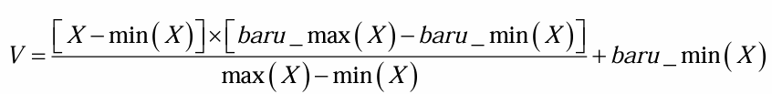
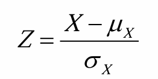
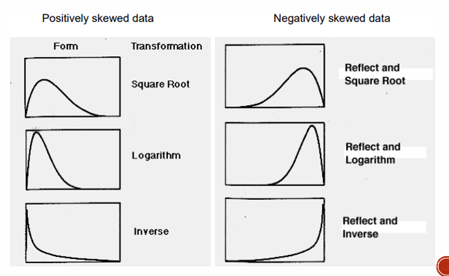
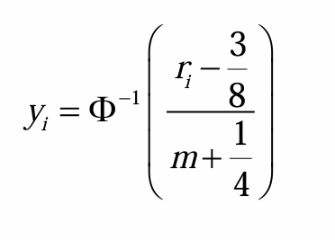
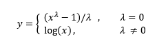

# 1. Penormalan Data

## 1.1 Penjelmaan skala data

### 1.1.1 Penormalan Min-Max:

{width="436"}

Skalakan semua p/ubah kepada unit yang sama

selang (0,1), tiada unit

```{r, echo=T, include=T}
dataAP3 = read.csv("D:/MSc DSc/Sem 1/Data Mining/UKMShape Data-20241201/dataAP3.csv", header=T)
head(dataAP3)
dataAP3 = dataAP3[-1]

attach(dataAP3)
names(dataAP3)
```

Ozone

```{r, echo=T, include=T}
min.03 = min(ozone_ppm)
min.03
max.03 = max(ozone_ppm)
max.03

new_max.03 = 1
new_min.03 = 0

new.03 = ((ozone_ppm - min.03)*(new_max.03 - new_min.03) / (max.03-min.03)) + new_min.03
head(new.03,5)
```

ulang untuk semua data p/ubah

analises perlombongan data akan dijalankan terhadap data yang diskalakan. Selepas analisis perlombongan data, keputusan perlu dijelmakan semula kepada unit data asal

```{r, ehco=T, include=T}
min.03 = 0
min.03
max.03 = 1
max.03

new_max.03 = max(ozone_ppm)
new_min.03 = min(ozone_ppm)

data.asal.03 = ((new.03 - min.03)*(new_max.03 - new_min.03) / (max.03-min.03)) + new_min.03
head(data.asal.03)
head(ozone_ppm)
```

### 1.1.2 Penormalan skor z

{width="115"}

```{r, echo=T, include=T}
mean.hPA = mean(pressure_height.hPA)
sd.hPA = sd(pressure_height.hPA)

z.score.hPA = (pressure_height.hPA - mean.hPA)/sd.hPA
head(z.score.hPA,10)

```

**ulang untuk semua data p/ubah**

analises perlombongan data akan dijalankan terhadap data yang diskalakan selepas analisis perlombongan data, keputusan perlu dijelmakan semula kepada unit data asal

```{r, echo=T, include=T}
data.asal.hPA = (z.score.hPA*sd.hPA) + mean.hPA

head(data.asal.hPA)
head(pressure_height.hPA)
```

### 1.1.3 Penormalan berdasarkan penskalaan perpuluhan

```{r, echo=T, include=T}
pHnew = pressure_height.hPA/10000
vpAnew = Visibility_pAerosol/1000
```

## 1.2 Penormalan Bentuk Taburan Data

{width="367"}

**guna data dataAP3**

### 1.2.1 Data Pencong ke kanan

#### a. Fungsi SQRT

```{r, echo=T, include=T}

Vis2 = sqrt(Visibility_pAerosol)

Vis3 = Vis2^2 # Tukar balik ke data asal

par(mfrow=c(1,3))
hist(Visibility_pAerosol, main="Data Asal")
hist(Vis2, main="Penjelmaan Data (SQRT)")
hist(Vis3, main="Penjelmaan Data asal (kuasa 2)")
par(mfrow=c(1,1))
```

#### b. Fungsi Log

```{r}
OzoneLog = log(ozone_ppm)

OzoneExp = exp(OzoneLog) # Tukar balik kepada data asal

par(mfrow=c(1,3))
hist(ozone_ppm, main="Data Asal")
hist(OzoneLog, main="Penjelmaan Data (Log)")
hist(OzoneExp, main="Penjelmaan Data Asal (Exp)")
par(mfrow=c(1,1))
```

Selepas analisis perlombongan data dijalankan, keputusan analisis perlu dijelmakan kepada data yang asal.

```{r, echo=T, include=T}
OzoneExp = exp(OzoneLog)
```

### 1.2.2 Data Pencong ke Kiri

$$
k=(max(x)+1)
$$

```{r, echo=T, include=T}

k = max(pressure_height.hPA) +1 # Dapatkan pusingan data
p = k-pressure_height.hPA

pH2 = sqrt(p) # jelmakan data
```

```{r, echo=T, include=T}
par(mfrow=c(1,3))
hist(pressure_height.hPA, main="Data Asal")
hist(p, main="Pantul Data")
hist(pH2, main="Penjelmaan Data terpantul (SQRT)")
par(mfrow=c(1,1))
```

Selepas analisis perlombongan dijalankan, perlu tukarkan kembali kepada data asal

```{r, echo=T, include=T}
pH3 = pH2^2
pH4 = k-pH3
hist(pH4, main="Jelmakan kepada Data Asal")
```

## 1.3 Kaedah menilai kenormalan taburan data

### 1.3.1 Pendekatan naif

Plot histogram atau plot kotak

```{r, echo=T,include=T}
hist(Vis2, main="Penjelmaan Data (SQRT)")
```

### 1.3.2 Plot normal kuantil

```{r, echo=T, include=T}
par(mfrow=c(1,2))
qqnorm(pressure_height.hPA, ylab='original pHA reading')
qqnorm(pH2, ylab='data dijelmakan')
par(mfrow=c(1,1))
```

### 1.3.3 Ujian Statistik

Ujian Kolmogorov-Smirnov

$$
H_0 : Data~cerapan = taburan~normal\newline
H_1 : Data~cerapan \not= taburan~normal\newline
$$

```{r echo=T, warning=FALSE, include=T}
n = length(pH2)
x = rnorm(n)
ks.test(pH2, x) # bandingkan data dijelmakan dengan data taburan
```

# 2. Pendiskretan

Membahagikan data atribut kepada beberapa selang (terselia vs tidak terselia)

-   Contoh : pokok-keputusan (*Decision Tree*)

-   Selanjar:Jumlah pendapatan,1000\< X\< 10000.

-   Selang:1000-2000,2000-3000,\>3000.

-   Diskrit/berkategori: 1=pendapatan rendah, 2=pendapatan, sederhana,3=pendapatan tinggi

## **2.1 Pendiskretan tidak terselia**

### 2.1.1 Menerusi pengetahuan domain - dibuat secara manual

```{r, echo=T, include=T}
library(infotheo)
data("USArrests")

attach(USArrests)
head(USArrests)
```

#### a. Dua Kategori

```{r, echo=T, include=T}

cutoff = 10 # perlu hujah dalam domain knowledge
Status.M = ifelse(Murder<=10, "Low Risk", "High Risk")

```

#### b. Lebih dari 2 kategori

1.  Boleh guna pernyataan nested ifelse

2.  Cara kodkan data

```{r echo=T, warning=FALSE, include=T}
library(car)
Status.Den = Recode(UrbanPop, "0:50 = 'Low Density';
                              51:70 = 'Moderate Density';
                              else = 'High Density'")
head(Status.Den,5)
```

### 2.1.2 Pendiskretan sama lebar (*Equal-width)* - $W = (B-A)/N$.

maklumat minimum $(A)$ dan maksiumum $(B)$ data $(X)$

```{r, echo=T, include=T}
Assault.Status = discretize(Assault, "equalwidth",4)
unique(Assault.Status)
```

### 2.1.3 Pendiskretan sama kekrapan (*Equal-Frequency)*

```{r, echo=T, include=T}
Rape.Stat = discretize(Rape,'equalfreq', 4)
unique(Rape.Stat)
```

Gabungkan Data

```{r, echo=T, include=T}
Discr_data = data.frame(Status.M, Status.Den, Assault.Status,Rape.Stat)
head(Discr_data,10)
```

## 2.2 Pendiskretan terselia

```{r}
library(discretization)
data(iris)
iris2 = chi2(iris,alp = 0.05,del = 0.05)$Disc.data
head(iris2,5)
```

## 2.3 Pendiskretan Setempat

apabila kita berurusan dengan **data** yang **bersifat heterogen**, dengan segmen data yang berbeza memerlukan strategi pendiskretan yang berbeza

**Contoh**: Dalam set data dengan **ketumpatan taburan data yang berbeza-beza**, pendiskretan setempat perlu untuk membina;

1.  bin-bin yang lebih kecil di kawasan yang mempunyai ketumpatan data yang tinggi

2.  bin-bin yang lebih besar di kawasan ketumpatan data yang rendah.

```{r, echo=T, include=T}
datalocal = read.csv("D:/MSc DSc/Sem 1/Data Mining/UKMShape Data-20241201/dataLocal.csv", header=T, sep=';')
data = datalocal[,1]
hist(data)
```

Andaikan ada 3 kategori dalam data

Boleh kenal pasti melalui kaedah pengkelompokan

### 2.3.1 Pendiskretan data berdasarkan kategori k-means

```{r, echo=T, include=T}
k = 3
kmeans_C = kmeans(data, centers = k)
kmeans_C
```

```{r, echo=T, include=T}
data_discretize = as.factor(kmeans_C$cluster)
head(data_discretize,10)
```

```{r}
data2 = cbind(data, data_discretize)

library(ggplot2)
ggplot(data.frame(data,data_discretize), aes(x=data, fill=data_discretize))+
  geom_histogram(bins=30, color='black')
```

# ---Latihan---

Jalankan pendiskretan data terhadap data - datalocal p/ubah dataL2

sepatutnya ada 3 class

## Kaedah K-Means

```{r}
datal2 = datalocal[,2]
#hist(datal2)
k=3

kmeans_dl2 = kmeans(datal2, centers = k)
datal2_discretize = as.factor(kmeans_dl2$cluster)

data3 = cbind(datal2, datal2_discretize)

ggplot(data.frame(datal2,datal2_discretize), aes(x=datal2, fill=datal2_discretize))+
  geom_histogram(bins=10, color='black')
```

## Kaedah *Equal-frequency*

```{r}
datal2
datal2.Stat = discretize(datal2,'equalfreq', 3)
datal2.factor = as.factor(datal2.Stat[,1])

data4 = cbind(datal2, datal2.factor)

ggplot(data.frame(datal2,datal2.factor), aes(x=datal2, fill=datal2.factor))+
  geom_histogram(bins=10, color='black')
```

# 3. Penjelmaan data membentuk atribut baru

## 3.1 Penjelmaan linear

Teknik ini melibatkan penjelmaan algebra mudah seperti hasil tambah, purata, putaran, dll

Misalkan $A~=~A_1,A_2,...,A_n$ ialah set atribut, dan misalkan $B~=~B_1,B_2,...B_m$ ialah subset bagi set atribut lengkap A

Atribut baru *Z* boleh dibentuk menerusi penjelmaan linear berikut:

$$
Z = r_iB_i~+~r_2B_2~+~...~+~r_MB_M 
$$

## 3.2 Penjelmaan data menerusi pengekodan

### 3.2.1 Pengekodan satu-hot

```{r, echo=T, include=T}
df = read.csv("D:/MSc DSc/Sem 1/Data Mining/UKMShape Data-20241201/df.csv", header=T, sep=';')
head(df,10)
```

Takrifkan fungsi pengekodan satu-hot

```{r, echo=T, include=T}
library(caret)

dummy = dummyVars("~.", data=df)
```

Jalankan pengekodan satu-hot

```{r}
df2 = data.frame(predict(dummy, newdata = df))
head(df2,10)
```

### 3.2.2 Pengekodan Ordinal

```{r, echo=T, include=T}
demographic = read.csv("D:/MSc DSc/Sem 1/Data Mining/UKMShape Data-20241201/demographic.csv", header=T, sep=';')
head(demographic,10)
```

kodkan data dalam kategori mengikut hierarki,

tukarkan struktur data kepada yang betul chr –\> ord.factor

```{r, echo=T,include=T}
attach(demographic)
str(demographic) # education_level in chr --> tukar kpd kategori

Edu_Level = c("High School", "Bachelor's Degree", "Master's Degree", "Doctorate")

demographic$Education_Level = factor(demographic$Education_Level, levels = Edu_Level, ordered = T )
str(demographic)
```

```{r, echo=T, include=T}
Inc_group = c('Low','Medium','High')

demographic$Income_Group = factor(demographic$Income_Group, levels = Inc_group, ordered = T)
str(demographic)
```

Jelmakan nilai faktor kepada berangka

```{r, echo=T, include=T}
demographic$Education_Level = as.numeric(demographic$Education_Level)
demographic$Income_Group = as.numeric(demographic$Income_Group)
# str(demographic)
head(demographic,10)
```

## 3.3 Penjelmaan Pangkat

{width="141"}

```{r, echo=T, include = T}
car_prices = read.table("D:/MSc DSc/Sem 1/Data Mining/UKMShape Data-20241201/car_prices.txt", header=T)
head(car_prices)
```

Pangkat yang lebih tinggi merujuk kepada harda kereta yang lebih mahal

```{r, echo=T, include=T}
ranked_prices = rank(car_prices$x)
ranked_prices
```

```{r, echo=T, include=T}
par(mfrow=c(1,2))
plot(car_prices$x, type='l', pch=16,
     main = 'original car prices')
plot(ranked_prices, type='l', pch=16,
     main = 'ranked car prices')
par(mfrow=c(1,1))
```

## 3.3 Penjelmaan Box-Cox



Terhad kepada data bukan negatif

Nilai $\lambda$ terbaik dipilih jika didapati taburan menghampiri normal.

```{r echo=T, warning=FALSE, include=T}
library(AID)
data(textile)
str(textile)
hist(textile[,1])
```

```{r, echo=T, include=T}
data2=textile[,1]
out = boxcoxnc(data2, method='mle',lambda = seq(-2,2,0.0001))
```

Data yang dijelmakan kepada taburan normal

```{r, echo=T, include=T}
y = (data2^(-0.0474)-1)/(-0.0474)
hist(y)
```

Selepas analisis perlombongan data dijalankan, keputusan analisis perlu dijelmakan kepada bentuk data yang asal

```{r, echo=T, include=T}
data.Asal = (y*(-0.0474)+1)^(1/0.0474)
hist(data.Asal)
```
