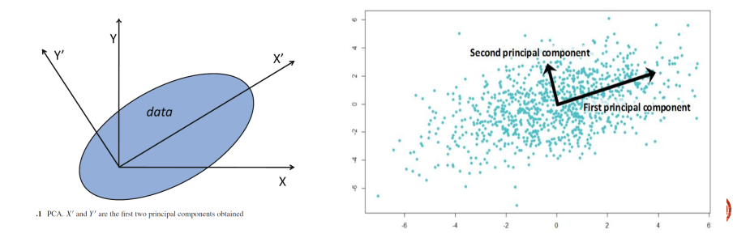
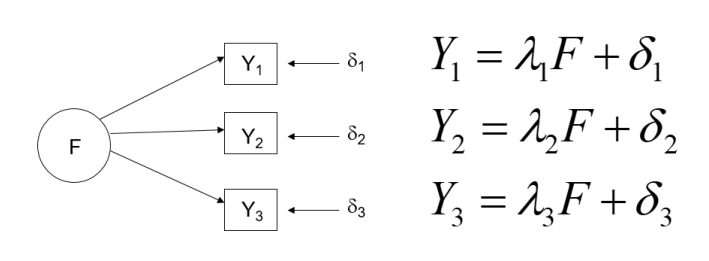

Terbahagi kepada 2:

1.  Penurunan Dimensi Data

2.  Penurunan Numerositi Data

# 1. Penurunan Dimensi Data

Data dengan dimensi besar boleh dikecilkan dimensi menerusi kaedah:

1.  Mengeluarkan Atribut. (Menggunakan Domain Knowledge)

2.  Analisis Komponen Utama.

3.  Analisis Faktor.

## 1.1 Mengeluarkan Atribut

### 1.1.1 Atribut hampir sama sifat

### 1.1.2 Atribut tidak relevan

### 1.1.3 Atribut tidak signifikan

```{r, echo=T, include=T}
library(ISLR)
data(Hitters)
head(Hitters,5)
```

```{r, echo=T, include=T}
str(Hitters)
```

```{r, echo=T, include=T}
Hitters2 = na.omit(Hitters)
```

Suaikan model rigresi

```{r, echo=T, include=T}
model.F = lm(Salary ~., data=Hitters2)
summary(model.F)
```

P/ubah yang diperlukan untuk analisis Salary

```{r, echo=T, include=T}
attach(Hitters2)
Hitters3 = cbind(Salary, AtBat, Hits, Walks, CWalks, Division, PutOuts)
head(Hitters3, 10)
model.G = lm(Salary~ AtBat+Hits+Walks+CWalks+Division+PutOuts)
summary(model.G)
```

## 1.2 Analisis Komponen Utama

{width="631"}

### **Prosedur PCA**

1.  Skalakan data input dengan mempiawaikan julat bagi setiap atribut (skor-z).

2.  Dapatkan k-set vektor ortogonal berdasarkan data yang telah di piawaikan.

3.  Komponen utama disusun secara sumbangan menurun berdasarkan maklumat nilai eigen. Komponen utama berfungsi sebagai set paksi-paksi baru untuk data yang diselaraskan mengikut varians data asal.

4.  Pengurangan dimensi data dibuat dengan membuang komponen yang memberikan sumbangan varians yang rendah:

    -   Hanya komponen utama yang menerangkan sumbangan varians yang tinggi dikekalkan sebagai set p/ubah baharu.

```{r, echo=T, include=T}
data = read.csv("D:/MSc DSc/Sem 1/Data Mining/Data/READING120n.csv", header=T)
head(data,10)
```

Keluarkan atribut bukan nombor

```{r,echo=T, include=T}
dat = data[,-1]
```

Huraikan data

```{r, echo=T, include=T}
library(psych)
describe(dat)
```

Skalakan data

```{r, echo=T, include=T}
zdata = scale(dat)
head(zdata,10)
```

Plot korelasi & taburan data

```{r echo=T, fig.height=6, fig.width=6, include=T}
pairs(zdata)
```

Lihat korelasi data

```{r, echo=T, include=T}
R = cor(zdata)
R
```

Bil atribut

```{r, echo=T, include=T}
p = ncol(zdata)
p
```

Nilai & Vektor Eigen

```{r, echo=T, include=T}
e = eigen(R)
ev = e$values
evr = e$vectors
e
```

peratusan varians bagi setiap p/ubah PCA

```{r, echo=T, include=T}
Prop.var = ev/length(ev)
cumsum(Prop.var)
```

Kita akan kekalkan 2 p/ubah PCA yang dapat menerangkan lebih 80% variasi data asal

```{r, echo=T, include=T}
y = zdata%*%evr
head(y,5)
```

```{r, echo=T, inclue=T}
colnames(y) = c('PCA1','PCA2','PCA3','PCA4','PCA5','PCA6')
head(y,5)
```

Data yang dikekalkan unutk analisis perlombongan data

```{r, echo=T, include=T}
data2 =y[,c(1,2)]
head(data2,5)
```

## 1.3 Analisis Faktor

{width="310"}

### 1.3.1 Model satu-faktor

### 1.3.2 Model dua-faktor

### 1.3.4 Putaran faktor

```{r, echo=T, include=T}
d = read.csv("D:/MSc DSc/Sem 1/Data Mining/Data/food-texture.csv", header=T, row.names ="X")
head(d)
```

```{r, echo=T, include=T}
describe(d)
```

Piawaikan Data

```{r, echo=T, include=T}
z_skor = scale(d)
```

```{r echo=T, include=T}
library(corrplot)
corrplot(cor(z_skor), order='hclust')

```

Scree Plot

```{r, echo=T, include=T}
scree(z_skor)
```

Jalankan analisis faktor

```{r, echo=T, include=T}
F.A = factanal(z_skor, factors=2, rotation='varimax')
F.A
```

```{r, echo=T, include=T}
F.A2 = factanal(z_skor, factors=2, rotation='varimax')
```

Data skor analisis faktor

```{r, echo=T, include=T}
FA.skor = factanal(z_skor, factors=2, scores='regression', rotation='varimax')
head(FA.skor$scores, 10)
```

# 2. Penurunam Numerositi Data

## 2.1 Model Berparameter

### 2.1.1 Model Regresi

```{r, echo=T,include=TRUE}
data = read.csv("D:/MSc DSc/Sem 1/Data Mining/Data/data.csv", header=T, sep=';')
head(data,10)
```

Kita berminat terhadap hubungan, *y = expenditure*, terhadap fitur yang lain

*x1 = income*

*x2 = education_level*

*x3 = work_experience*

**Andaian model regresi = Y menghampiri normal**

```{r,echo=T,include=T}
attach(data)
hist(expenditure)
```

Perlu jelmakan kepada normal

```{r, echo=T, include=TRUE}
y2 = log(expenditure)
hist(y2, main = "Log of Expenditure")
```

```{r, echo=T, include=T}

data$education_level = as.factor(education_level)

model_reg = lm(log(expenditure) ~ income + data$education_level + work_experience)
summary(model_reg)
```

```{r, echo=T, include=T}
coef(model_reg)
```

R^2^ \>0.99, menunjukkan model ini seesuai untuk mewakili data asal. Simpan maklumat berkaitan model;

1.  Parameter model - coefficient

    $$
    log(expenditure)~=~0.9621+0.0005(income)~+~0.1872(education\_level2)~+~0.3292(education\_level3)~+~0.4297(education\_level4)~+~0.8722(education\_level5)~+~0.0831(work\_experience)
    $$

2.  Maklumat fitur Xi

```{r, echo=T, include=T}
# X1 = income
muIn = mean(income)
sdIn = sd(income)
IncomeR = range(income)
hist(income)
```

```{r, echo=T, include=T}
# X2 = education_level
education_range = 1:5
```

```{r, echo=T, include=T}
# X3 = work_experience
muWE = mean(work_experience)
sdWE = sd(work_experience)
workExpR = range(work_experience)
hist(work_experience)
```

Jika mahu jalankan analisis terhadap data, boleh janakan data simulasi menggunakan model & maklumat fitur

#### Simulasi fitur

Income

```{r, echo=T, include=T}
n = 200
income.sim = rnorm(n, mean=muIn, sd=sdIn)

par(mfrow=c(1,2))
hist(income , main='Original')
hist(income.sim , main='Simulation')
par(mfrow=c(1,1))
```

Education Level

```{r, include=T, echo=T}
education.sim = sample(1:5, n, replace=T)
education.sim = as.factor(education.sim)
```

Work Experience

```{r, echo=T, include=T}
n = 200
workEX.sim = rnorm(n, mean=muWE, sd=sdWE)

par(mfrow=c(1,2))
hist(work_experience , main='Original')
hist(workEX.sim , main='Simulation')
par(mfrow=c(1,1))
```

Gabungan fitur simulation ke data frame

```{r, echo=T, include=T}
n = 200
fitur.sim = data.frame(workEX.sim, education.sim, income.sim)
```

Data simulasi y

```{r, echo=T, include=T}
sim.expend = predict(model_reg,fitur.sim)
head(sim.expend, 10)
```

Data simulasi lengkap

```{r, echo=T, include=T}
expenditure2 = exp(sim.expend) # jelmakan balik kepada data asal
new_df = cbind(fitur.sim, expenditure2)
head(new_df,10)
```

```{r, echo=T, include=T}
par(mfrow=c(1,2))
hist(data$expenditure ,main='Original')
hist(expenditure2 ,main='Simulation')
par(mfrow=c(1,1))
```

## 2.2 Model Tak Berparameter

1.  Histogram/pendisketan

2.  Pengkelompokan

3.  Pensampelan semula (butstrap)

### 2.2.1 Teknik Pensampelan semula

```{r, exho=T, include=T}
dataKe = read.table("D:/MSc DSc/Sem 1/Data Mining/Data/Kewangan.D.txt", header=T)
head(dataKe, 10)
```

Strata Bangsa

```{r, echo=T, include=T}
table(dataKe$Bangsa)/length(dataKe$Bangsa) # data tak bagus, tak represent population
```

60% Malay, 30% Cina, 10% India

```{r, echo=T, include=T}
sM = 3000*0.6
sC = 3000*0.3
sI = 3000*0.1
```

Subset berdasarkan strata

```{r, echo=T, include=T}
d1 = subset(dataKe, Bangsa == "Melayu")
d2 = subset(dataKe, Bangsa == "Cina")
d3 = subset(dataKe, Bangsa == "India")
```

Pensampelan semula

```{r, echo=T, include=T}

N1 = sample(nrow(d1), size=sM, replace = FALSE)
SN1 = d1[N1,]

N2 = sample(nrow(d2), size=sC, replace = FALSE)
SN2 = d2[N2,]

N3 = sample(nrow(d3), size=sI, replace = FALSE)
SN3 = d3[N3,]

samp = rbind(SN1,SN2,SN3)

str(samp)
```
