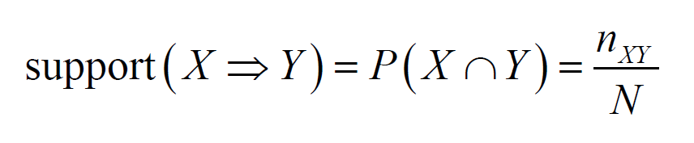
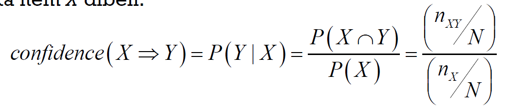
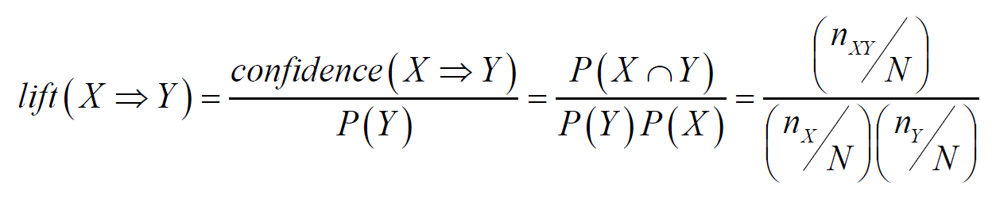

Left-hand-side and right-hand-side

$$
X \rightarrow Y
$$

**Tiga ukur asas memilih aturan sekutuan**

1.  Support\
    

2.  Confidence\
    

3.  Lift\
    

    -   $lift(X \rightarrow Y)=1$ , X and Y tidak bersandar
    -   $lift(X \rightarrow Y)>1$ , X dan Y mempunyai kesan pelengkap
    -   $lift(X \rightarrow Y)<1$ , X dan Y mempunyai kesan pengganti

| Metric | What it Measures | Focus | Interpretation |
|----|----|----|----|
| **Support** | Frequency of the itemset | How common the rule is | Absolute measure of occurrence |
| **Confidence** | Reliability of the rule | How strong the rule is | Conditional probability |
| **Lift** | Strength of association | Rule's importance | Relative to random chance |

# Algorithma Apriori

```{r, echo=T, include=F}
library(arules)
library(arulesViz)
```

import data transaksi

```{r}
tdata = read.transactions("E:/Master-Data-Science/Semester_1/Data_Mining/Data/groceries.csv", sep=',')
head(tdata,10)
```

```{r}
class(tdata)
```

Deskriptif data

```{r}
inspect(head(tdata,12))
```

```{r}
LIST(head(tdata,10))
```

Bilangan item bagi setiap transaksi

```{r}
size(head(tdata,10))
```

## Bagaimana untuk melihat item yang paling kerap dibeli?

```{r}
itemFrequencyPlot(tdata, topN=10,
                  main='10 Item paling kerap dibeli')
```

## Bagaimana untuk mendapatkan A turan Sekutuan yang signifikan bagi cadangan produk?

Perlu setkan nilai minimum ambang bagi sokongan dan keyakinan

> Support = 0.01, Confidence = 0.5

```{r}
Aturan.S1 = apriori(tdata, 
                    parameter=list(supp=0.01, conf=0.3))
```

```{r}
inspect(Aturan.S1)
```

### Lihat aturan dengan tertib lif menurun

```{r}
Aturan.S2 = sort(Aturan.S1, by='lift',
                 decreasing = T)
inspect(Aturan.S2)
```

### Lihat aturan dengan tertib keyakinan menurun

```{r}
Aturan.S3 = sort(Aturan.S1, by='confidence',
                 decreasing = T)
inspect(Aturan.S3)
```

### Lihat aturan dengan tertib support menurun

```{r}
Aturan.S4 = sort(Aturan.S1, by='support',
                 decreasing = T)
inspect(Aturan.S4)
```

## Bagaimana untuk mengvisualkan corak dan pola bagi aturan sekutuan yang signifikan?

### Plot rangkaian

```{r}
plot(Aturan.S1, method='graph')
```

### Plot Koordinat Selari

```{r}
plot(Aturan.S1, method='paracoord',
     control=list(reorder=T))
```

Jika bilangan aturan sekutuan yang diperolehi adalah terlalu banyak, perlu tinggikan nilai ambang ukuran untuk kekalkan aturan sekutuan yang lebih bermakna.

> Support = 0.01, Confidence = 0.5

```{r, echo=T, include=F}
Aturan.S5 = apriori(tdata, 
                    parameter = list(supp=0.01, conf = 0.5))
```

```{r}
plot(Aturan.S5, method='graph')
```

```{r}
plot(Aturan.S5, method='paracoord')
```

## Bagaimana untuk mendapatkan Aturan Sekutuan yang berkait dengan item tertentu?

### Kes 1: Dapatkan aturan yang mempengaruhi Aturan Sekutuan yang berkai dengan item Y (RHS)

Contoh: Barangan apa yang akan dibeli terlebih dahulu sebelum pelanggan membeli item "other vegetables"

```{r, include=F}
Aturan.S6 = apriori(tdata,
                    parameter=list(supp=0.01, conf=0.5),
                    appearance = list(default='lhs',rhs='whole milk'))
```

```{r}
inspect(Aturan.S6)
```

Contoh: Barangan apa yang akan dibeli terlebih dahulu sebelum pelanggan membeli item "yogurt"

```{r, include=F}
Aturan.S7 = apriori(tdata,
                    parameter=list(supp=0.01, conf=0.08),
                    appearance = list(default='lhs',rhs='yogurt'))
```

```{r}
inspect(Aturan.S7)
```

```{r}
plot(Aturan.S7, method='paracoord',
     control=list(reorder=T))
```

### Kes 2: dapatkan aturan bagi produk apa yang biasa dibeli selepas pembelian item X (LHS)

Barangan apa yang akan dibeli selepas membeli "yogurt".

```{r, include=F}
Aturan.S8 = apriori(tdata,
                    parameter=list(supp=0.01, conf=0.08),
                    appearance = list(default='rhs',lhs='yogurt'))
```

```{r}
inspect(Aturan.S8)
```

```{r}
plot(Aturan.S8, method='paracoord',
     control=list(reorder=T))
```

```{r}
plot(Aturan.S8, method='graph')
```
