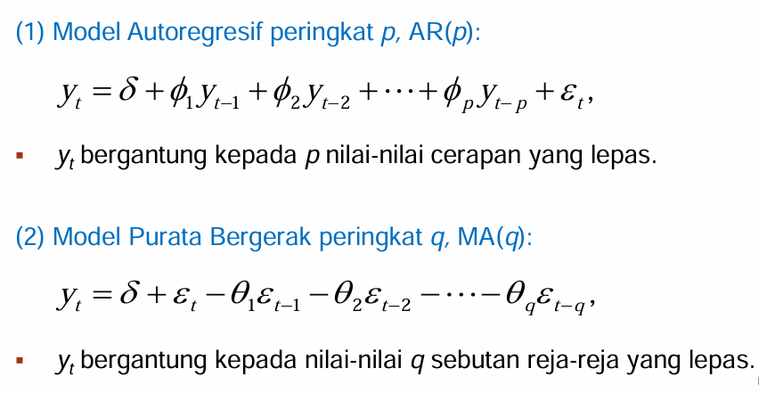
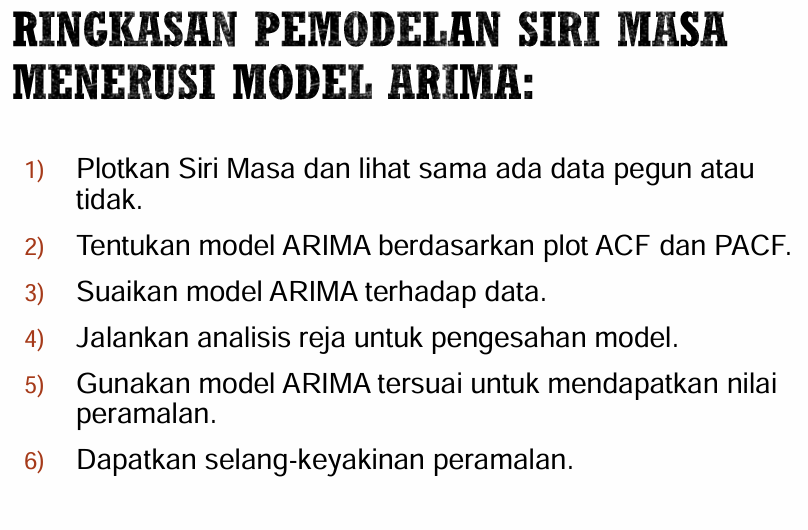

# 1. Bina objek masa dan tarikh dalam R

```{r}
set.seed(123)
data1 = rnorm(12)
```

Takrifkan unit masa terhadap data

## 1.1 Data ialah data bulanan bermula dari Februrari 2020

```{r}
X1 = ts(data1, start=c(2020,2), frequency=12)
X1
```

## 1.2 Data ialah data suku tahunan bermula dari suku ketiga tahun 2020

```{r}
X2 = ts(data1, start=c(2020,3), frequency=4)
X2
```

## 1.3 R mengadaptasi format masa data **ISO 8601**

```{r}
date = Sys.Date()
date
```

## 1.4 Bina tarikh harian bermula dari 2016-01-01 hingga 2018-12-31

```{r}
daily_index = seq.Date(from=as.Date('2016-01-01'), to=as.Date('2018-12-31'), by='day')
head(daily_index,10)
```

## 1.5 Bina tarikh 3 hari selang bermula dari 2016-01-01 hingga 2018-12-31

```{r}
daily_3day = seq.Date(from=as.Date('2016-01-01'), to=as.Date('2018-12-31'), by='3 days')
head(daily_3day,10)
```

## 1.6 Bina tarikh bulanan bermula dari 2016-01-01 hingga 2018-12-31

```{r}
monthly_index = seq.Date(from=as.Date('2016-01-01'), to=as.Date('2018-12-31'), by='month') 
head(monthly_index,10)
```

### Exercise

```{r}
dates_df = read.csv("D:/MSc DSc/Sem 1/Data Mining/Data/dates_formats3.csv", header=T, sep = ';', stringsAsFactors = FALSE)
head(dates_df,10)
```

```{r}
str(dates_df)
```

Reformat into ISO

#### US Format

```{r}
US_format_new = as.Date(dates_df$US_format, format = "%m/%d/%Y")
str(US_format_new,10)
```

#### CA_Mix_Format

```{r}
CA_mix_format_new = as.Date(dates_df$CA_mix_format, format = "%B %d, %Y")
str(CA_mix_format_new)
```

#### Japanese_format

```{r}
Japanese_format_new = as.Date(dates_df$Japanese_format, format = "%d/%m/%Y")
str(Japanese_format_new)
```

#### SA_mix_format

```{r}
SA_mix_format_new = as.Date(dates_df$SA_mix_format, format = "%d %B %Y")
str(SA_mix_format_new)
```

#### NZ_format

```{r}
NZ_format_new = as.Date(dates_df$NZ_format, format="%d/%m/%Y")
str(NZ_format_new)
```

```{r}
new_df = data.frame(cbind(Japanese_format_new,US_format_new,CA_mix_format_new,SA_mix_format_new, NZ_format_new))
head(new_df)
```

```{r}
library(lubridate)
date_df = as.Date(as.character(new_df), format = '%Y%m%d')
date_df
```

# 2. Kelas data siri masa dalam

## 2.1 Kelas TS

```{r}
X1 = ts(data1, start=c(2020,2), frequency=12)
X1
```

## 2.2 Kelas TimeSeries

```{r}
library(timeSeries)
data(MSFT)
class(MSFT)
```

## 2.3 Kelas Zoo

```{r}
library(TSstudio)
library(zoo)
data(US_indicators)
str(US_indicators)
```

```{r}
Vehicle_Sale1 = zoo(x=US_indicators$`Vehicle Sales`, frequency=12)
str(Vehicle_Sale1)
```

## 2.4 Kelas Date

```{r}
NZ_format_new = as.Date(dates_df$NZ_format, format="%d/%m/%Y")
str(NZ_format_new)
```

## 2.5 Kelas Xts

```{r}
library(xts)
US_indicators2 = xts(x=US_indicators[, c('Vehicle Sales','Unemployment Rate')],
                    frequency=12, order=US_indicators$Date)
str(US_indicators2)
```

## 2.6 Kelas POSIX

```{r}
time_str = "2018-12-31 23:59:30"
time_POSIX = as.POSIXct(time_str)
time_POSIX
```

# 2. Kaedah Penguraian Siri Masa

## 2.1 Penguraian Bertambah

```{r}
library(USgas)
data("usgas")
head(usgas)

ts.plot(usgas,
        main="US monthly Natural Gas Consumption",
        ylab="Billion Cubic Feet",
        xlab='Year')
```

```{r}
install.packages("TSstudio")
library(TSstudio)
data(USVSales)
ts.plot(USVSales,
        main="US monthly Natural Gas Consumption",
        ylab="Billion Cubic Feet",
        xlab='Year')
```

```{r}
usgas.decompose = decompose(USgas)
plot(usgas.decompose)
```

boleh ekstrak data setiap komponen untuk analisis lanjut

```{r}
names(usgas.decompose)
```

### Komponen Trend

```{r}
head(usgas.decompose$trend)
```

### Komponen Bermusim

```{r}
head(usgas.decompose$seasonal)
```

### Komponen Rawak

```{r}
head(usgas.decompose$random)
```

## 2.2 Penguraian Berganda

```{r}
data(AirPassengers)
ts.plot(AirPassengers,
        main="Monthly Airline Passengers",
        ylab="Thousand of Units",
        xlab='Year')
```

```{r}
AirP_decompose = decompose(AirPassengers, type='multiplicative')
plot(AirP_decompose)
```

### Komponen Trend

```{r}
head(AirP_decompose$trend,10)
```

### Komponen Bermusim

```{r}
head(AirP_decompose$seasonal,10)
```

### Komponen Rawak

```{r}
head(AirP_decompose$random,10)
```

## 2.2.3. ARIMA Modelling



Kepegunan Siri Masa

$$
1.~\sum(y_t) = u_t,~untuk~semua~t
$$

$$
2.~Var(y_t) = \sum[(y_t-u_y)^2]~=~\sigma^2
$$

$$
Cov(y_t,y_{t-k})~=~\gamma_k,~untuk~semua~t
$$

```{r}
data = read.csv("D:/MSc DSc/Sem 1/Data Mining/Data/towel.csv", header=T)
yt=ts(data)
head(yt,10)
```

```{r}
ts.plot(yt,
        main="Paper Towel Daily Sales",
        ylab="yt",
        xlab='Day')
```

Data tak pegun, keputusan tak tepat

Jalankan pembezaan terhadap data unntuk jadikan data menghampiri sifat kepegunan

```{r}
ztl = diff(yt, differences=1)
ts.plot(ztl,
        main="Data Pembezaan Tertib 1",
        ylab="ztl")
```

Data pembezaan peringkat-1 adalah pegun

#### Penentuan model ARIMA (p,i,q)

Plotkan fungsi ACF dan PACF

```{r}
acf(ztl,main="Fungsi Autokorelasi")
```

```{r}
pacf(ztl,main="Fungsi Autokorelasi Separa")
```

Berdasarkan plot ACF dan PACF, didapati ACF terpangkas pada tertib 1 dan PACF menurun terhadap masa.

Model yang mungkin sesuai ialah ARIMA(0,1,1)

```{r}
model = arima(yt,order=C(0,1,1))
summary(model)
```

##### Dapatkan model ARIMA yang sesuai secara automatik

```{r}
library(forecast)
auto.arima(yt)
```

```{r}
ts.plot(yt,
        main="Paper Towel Daily Sales",
        ylab="yt",
        xlab='Day');lines(fitted(model), col='red', lty=2);legend("bottomleft", c("Observed Data","Model ARIMA (0,1,1)"), col=c(1,2), lty=c(1,2))
```

#### Analisis Reja [*Residuals*] (Diagnostic Model)

1.  Reja adalah tak berkorelasi.

2.  Reja tertabur secara normal.

3.  Varians bagi reja adalah malar terhadap masa.

```{r}
f.value = forecast(model, h=5)
resid = f.value$residuals
```

#### Reja adalah tak berkolerasi

```{r}
acf(resid)
```

#### Reja tertabur secara normal.

```{r}
hist(resid)
```

#### Varians bagi reja adalah malar terhadap masa.

```{r}
plot.ts(resid)
```

#### Peramalan berdasarkan model

```{r}
fore = predict(model, n.ahead=5)
fore
```

#### 50% selang keyakinan

```{r}
U = fore$pred+0.69*fore$se
L = fore$pred-0.69*fore$se

ts.plot(yt, fore$pred, U, L,
        main="Paper Towel Daily Sales",
        col = c(1,2,4,4), lty=c(1,1,2,2));legend("bottomleft", c("Observed Data", "Forecast", "Confidence Interval 50%"), col=c(1,2,4), lty=c(1,1,2))
```

# Latihan

## 1. Import economic_data.csv.

```{r}
econ = read.csv("D:/MSc DSc/Sem 1/Data Mining/Data/economic_data.csv", header = T, sep=';')
head(econ,10)
```

## 2. Takrifkan data kepada format siri masa iaitu ianya adalah data bulanan bermula Januari 2000.

```{r}
econ_time = ts(econ$Economic_Data.x, start=c(2000,1), frequency=12)
econ_time
```

```{r}
str(econ_time)
```

## 3. Plotkan siri masa tersebut.

```{r}
ts.plot(econ_time,
        main="Economic Data",
        ylab="Economic Data",
        xlab='Month')
```

Komponen Trend

```{r}
econ.decompose = decompose(econ_time)
plot(econ.decompose)
```

## 4. Kenalpasti dan suaikan model ARIMA yang sesuai terhadap data.

```{r}
econ_k = diff(econ_time, differences=1)
ts.plot(econ_k,
        main="Data Pembezaan Tertib 1",
        ylab="econ_k")
```

Plotkan fungsi ACF dan PACF

```{r}
acf(econ_k,main="Fungsi Autokorelasi")
```

```{r}
pacf(econ_k,main="Fungsi Autokorelasi Separa")
```

```{r}
auto.arima(econ_time)
```

```{r}
model2 = auto.arima(econ_time)
summary(model2)

```

## 5. Jalankan peramalan terhadap data untuk 24 bulan seterusnya.

```{r}
econ_pred = forecast(model2, h=24)
str(econ_pred)
```

## 6. Plotkan peramalan bersama selang keyakinan.

```{r}
autoplot(econ_pred)
```



# 3. Pengkelompokan siri masa

```{r}
ts.plot(sample2)
```

```{r}
par(mfrow=c(3,3))  # Set up a 3x3 grid for plots
for (i in 1:9) {   # Loop over the indices from 1 to 9
  plot.ts(sample2[,i])  # Plot the i-th column of 'sample2'
}
```

```{r}
library(dtw)
D.Labels = rep(1:60)
distMatrix = dist(sample2, method = 'DTW')
TSCluster = hclust(distMatrix, method = 'average')
```

Pangkas untuk dapatkan bilangan kelompok

```{r fig.height=6, fig.width=10}
plot(TSCluster, labels = D.Labels,main = 'Time Series Clustering');rect.hclust(TSCluster, k =4)
```

Kelompok 1

```{r fig.height=6, fig.width=10}
par(mfrow=c(2,4))
plot.ts(sample2[,34]);plot.ts(sample2[,35]);plot.ts(sample2[,32]);plot.ts(sample2[,37]);plot.ts(sample2[,33]);plot.ts(sample2[,31]);plot.ts(sample2[,36])
```

Kelompok 2

```{r fig.height=6, fig.width=10}
par(mfrow=c(2,4))
plot.ts(sample2[,17]);plot.ts(sample2[,19]);plot.ts(sample2[,11]);plot.ts(sample2[,14]);plot.ts(sample2[,13]);plot.ts(sample2[,12]);plot.ts(sample2[15])
```

## Klasifikasi Siri Masa

```{r}
newdata = read.csv("D:/MSc DSc/Sem 1/Data Mining/Data/newdata.csv", header=T, sep=';')
head(newdata)
```

```{r}
newdata$pattern100 = as.factor(newdata$pattern100)
library(party)
model3 = ctree(pattern100~.,newdata)
model3
```

```{r}
matriks_konfusi = table(Predicted = predict(model3, newdata), Actual = newdata$pattern100)
matriks_konfusi
```

```{r}
precision_model = sum(diag(matriks_konfusi))/sum(matriks_konfusi)
precision_model
```
