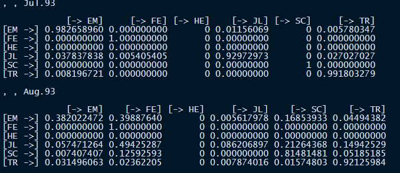

```{r, include=F}
library(TraMineR)
```

```{r}
data(mvad)
str(mvad)
```

Lajur 1-14 adalah maklumat demografi, bukan data jujukan.

Data jujukan bermula lajur 15-86.

## Takrifkan label dan kod bagi setiap keadaan.

```{r}
mvad.labels = c('employment','further education','higher education','joblessness','school','training')
mvad.scode = c('EM','FE','HE','JL','SC','TR')
```

## Bina data kelas jujukan

```{r}
mvad.seq = seqdef(mvad, 15:86, states=mvad.scode, labels = mvad.labels,
                  xtstep=6)
head(mvad.seq,10)
```

```{r}
class(mvad.seq)
```

# Penunjuk ringkasan statistik

## 1. Min (purata) masa proses berada dalam setiap keadaan.

```{r}
seqmeant(mvad.seq)
```

## 2. Min (purata) masa proses berada dalam setiap keadaan bagi kumpulan tertentu.

Bagi kumpulan Jantina

```{r}
by(mvad.seq,mvad$male,seqmeant)
```

```{r}
seqmtplot(mvad.seq, group = mvad$male, main='Lelaki')
```

```{r}
by(mvad.seq,mvad$funemp,seqmeant)
```

Pengvisualan

```{r}
seqmtplot(mvad.seq, group = mvad$funemp, main='Father Unemployment Status')
```

## 3. Bilangan transisi (peralihan)

```{r}
head(seqtransn(mvad.seq),10)
```

```{r}
hist(seqtransn(mvad.seq), main = 'Bilangan Transisi')
```

## 4. Kadar peralihan.

```{r}
mvad.trate = seqtrate(mvad.seq)
mvad.trate
```

## 5. Keadaan peralihan yang bergantung terhadap masa.

```{r,include=F}
mvad.trate2 = seqtrate(mvad.seq, time.varying = TRUE)
mvad.trate2
```



# Pengvisualan

## Plot indeks jujukan

20 Individu pertama

```{r}
seqiplot(mvad.seq, main='Plot indeks jujukan',
         idxs=1:20)
```

pilih individu khusus (1,2,15,90,200,267, 456,666,700)

```{r}
seqiplot(mvad.seq, main='Plot indeks jujukan',
         idxs=c(1,2,15,90,200,267, 456,666,700))
```

## Plot Jujukan kekerapan

```{r}
filtered.seq = mvad.seq[seqtransn(mvad.seq) > 8, ]
```

```{r}
table(seqtransn(filtered.seq))
```

```{r}
seqiplot(filtered.seq)
```

```{r}
seqtrate(filtered.seq)
```
