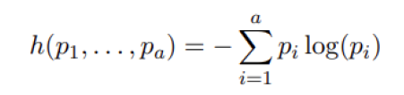

```{r, include=F}
library(TraMineR)
```

```{r}
data(mvad)
str(mvad)
```

Lajur 1-14 adalah maklumat demografi, bukan data jujukan.

Data jujukan bermula lajur 15-86.

## Takrifkan label dan kod bagi setiap keadaan.

```{r}
mvad.labels = c('employment','further education','higher education','joblessness','school','training')
mvad.scode = c('EM','FE','HE','JL','SC','TR')
```

## Bina data kelas jujukan

```{r}
mvad.seq = seqdef(mvad, 15:86, states=mvad.scode, labels = mvad.labels,
                  xtstep=10)
head(mvad.seq,10)
```

```{r}
seqiplot(mvad.seq)
```

```{r}
class(mvad.seq)
```

# Penunjuk ringkasan statistik

## 1. Min (purata) masa proses berada dalam setiap keadaan.

```{r}
seqmeant(mvad.seq)
```

## 2. Min (purata) masa proses berada dalam setiap keadaan bagi kumpulan tertentu.

Bagi kumpulan Jantina

```{r}
by(mvad.seq,mvad$male,seqmeant)
```

```{r}
seqmtplot(mvad.seq, group = mvad$male, main='Lelaki')
```

```{r}
by(mvad.seq,mvad$funemp,seqmeant)
```

Pengvisualan

```{r}
seqmtplot(mvad.seq, group = mvad$funemp, main='Father Unemployment Status')
```

## 3. Bilangan transisi (peralihan)

```{r}
head(seqtransn(mvad.seq),10)
```

```{r}
hist(seqtransn(mvad.seq), main = 'Bilangan Transisi')
```

## 4. Kadar peralihan.

```{r}
mvad.trate = seqtrate(mvad.seq)
mvad.trate
```

## 5. Keadaan peralihan yang bergantung terhadap masa.

```{r,include=F}
mvad.trate2 = seqtrate(mvad.seq, time.varying = TRUE)
mvad.trate2
```


# Pengvisualan

## Plot indeks jujukan

20 Individu pertama

```{r}
seqiplot(mvad.seq, main='Plot indeks jujukan',
         idxs=1:20)
```

pilih individu khusus (1,2,15,90,200,267, 456,666,700)

```{r}
seqiplot(mvad.seq, main='Plot indeks jujukan')
```

## Plot Jujukan kekerapan

20 jujukan yang paling kerap berlaku

```{r fig.height=8,fig.width=8}
seqfplot(mvad.seq, main='20 jujukan yang paling kerap berlaku',
         idxs=1:20)
```

## Plot taburan keadaan

corak umum keseluruhan set trajektori dalam data jujukan

```{r}
seqdplot(mvad.seq, border=NA, 
    main='plot taburan keadaan')
```

## Plot keadaan modal

jujukan bagi keadaan yang paling kerap berlaku pada setiap kedudukan

keadaan dominan pada setiap masa

```{r}
seqmsplot(mvad.seq)
```

# Indeks Entropi

Ukuran terhadap variasi keadaan dalam dalam data jujukan



dengan $p_i$ ialah perkadaran entiti dalam keadaan-i, $a$ ialah bilangan keadaan.

Jika nilai entropi= 0 menunjukkan bahawa semua entiti berada dalam keadaan yang sama (variasi adalah 0)

## Entropi Rentas Lintang

```{r}
seqHtplot(mvad.seq, main='Entropi Rentas Lintang')
seqdplot(mvad.seq, border=NA, main='plot taburan keadaan')
```

# Data Jujukan Peristiwa

```{r}
mvad.seqe = seqecreate(mvad.seq)
head(mvad.seqe)
```

## Sub-jujukan

```{r}
fsubseq = seqefsub(mvad.seqe, pmin.support=0.05)
```

15 subjujukan paling kerap

```{r fig.height=8, fig.width=6}
plot(fsubseq[1:15], col='yellow')
```

# Mengkategorikan corak

```{r}
library(cluster)
```

```{r}
submat = seqsubm(mvad.seq, method = 'TRATE')
submat
```

```{r}
dist.om = seqdist(mvad.seq, method='OM',sm=submat)
```

dapatkan kelompok dalam data berdasarkan jarak optimum

```{r}
clusterward = agnes(dist.om, diss=T, method='ward')
plot(clusterward);abline(h=800, lty='dotted', col='red')
```

misalkan k=4 kelompok adalah signifikan

```{r}
cl.4 = cutree(clusterward, 4)
cl4fac = factor(cl.4, labels=paste("Kumpulan", 1:4))
head(cl4fac)
```

## Jalankan analisis lanjutan terhadap setiap group

setiap individu dalam kumpulan yang sama akan mempunyai ciri yang hampir sama

```{r}
seqfplot(mvad.seq, group = cl4fac,
         main='10 jujukan yang paling kerap berlaku',
         idxs=1:10)
```

```{r}
seqdplot(mvad.seq,
         group=cl4fac,
         border=NA, 
         main='plot taburan keadaan')
```

```{r}
seqHtplot(mvad.seq,group=cl4fac, main='Entropi Rentas Lintang')
```

```{r}
seqmsplot(mvad.seq, group=cl4fac)
```

## sub-jujukan bagi setiap group

```{r}
disc = seqecmpgroup(fsubseq, group = cl4fac)
plot(disc[1:6])
```
