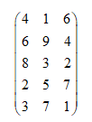
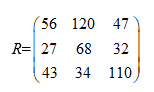

# Exercise 1

Use R as you would a calculator to find numeric answers to the following (show your work):

1.   1+2(3+4)

```{r}
1+2*(3+4)
```

2.  $\sqrt{(4+3)(2+1)}$

```{r}
sqrt((4+3)*(2+1))
```

3.  $cos(4\pi)$

```{r}
cos(4*pi)
```

4.  $ln(0)$

```{r}
log(0)
```

5.  6!

```{r}
factorial(6)
```

6.  $^{52}C_5$

```{r}
choose(52,5)
```

7.  $(1+2i)(1-2i)$

```{r}
(1+2i)*(1-2i)
```

8.  $\sqrt{-1}$

```{r}
sqrt(-1)
sqrt(as.complex(-1))
```

# Exercise 2

## 2.1 Let our small dataset be:

2 5 4 10 8

1.  Enter this data into a data vector named x.

```{r}
x = c(2,5,4,10,8)
```

2.  Find the square root of each number.

```{r}
sqrt(x)
```

3.  Subtract 6 from each number.

```{r}
x-6
```

4.  Divide each number by 10 and find the square for each of the number.

```{r}
(x/10)^2
```

## 2.2 You recorded the number of sales for a certain day from employees in a company as follows:

1 1 3 4 7 11

1.  Find the number of employees you recorded.

```{r}
x = c(1,1,3,4,7,11)
length(x)
```

2.  Calculate the total sales for the day.

```{r}
sum(x)
```

3.  Find the vector of cumulative sums for the data you produce.

```{r}
cumsum(x)
```

4.  If the number of sales for all the emplyees are the same for 3 days, calculate the product of sales for the 3 days. i.e (Total Sales Day 1) × (Total Sales Day 2) × (Total Sales Day 3)

```{r}
27^3
```

## 2.3 The vector y has the following values as its elements:

3 6 14 90 54 2 8 65 28 45 7

1.  Find a vector of logical expressions where TRUE is for elements of y that have values greater than 30

```{r}
y = c(3,6,14,90,54,2,8,65,82,45,7)
y>30
```

2.  Find the vector where only values less than 10 is recorded.

```{r}
y[y<10]
```

3.  What is the length for the vector with values more than or equal to 10?

```{r}
length(y[y>=10])
```

4.  Add 5 to the first five values of the vector y.

```{r}
y[1:5] +5
```

# Exercise 3

## 3.1 A matrix as below is observed



1.  What is the dimension for the matrix?

```{r}
y = c(4,1,6,6,9,4,8,3,2,2,5,7,3,7,1)
x = matrix(y, ncol=3, nrow=5, byrow=T)
dim(x)
```

2.   Add 3 to each element of the matrix.

```{r}
z = x+3
z
```

3.  Find he transpose matrix.

```{r}
t = t(x)
t
```

4.  Do matrix multiplication of the matrix and its transpose.

```{r}
x%*%t
```

## 3.2


Find $AB^{-1}$ and $BA^T$.

```{r}
A = matrix(c(1,2,3,2,2,1,6,4,4,7,2,5), nrow=3,ncol=4,byrow = T)
B = matrix(c(1,3,5,2,0,1,3,4,2,4,7,3,1,5,1,2), nrow=4,ncol=4,byrow=T)

AB_1 = A%*%solve(B)
AB_1
```

```{r}
BA_T = B%*%t(A)
BA_T
```

## 3.3 Find a matrix of logical expressions for all elements in the matrix below where TRUE are elements that have values less than 50.



```{r}
R = matrix(c(56,120,47,27,68,32,43,34,110), nrow=3,ncol=3,byrow=T)
R<50
```
