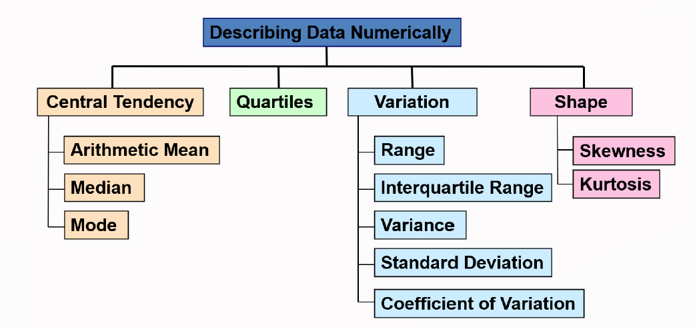
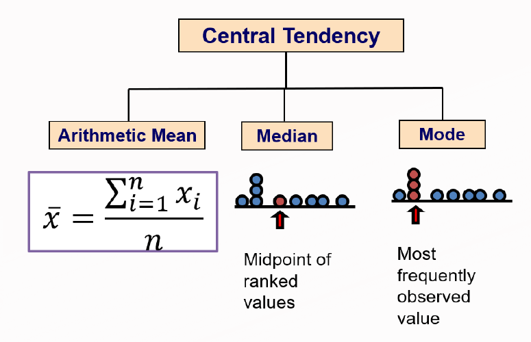
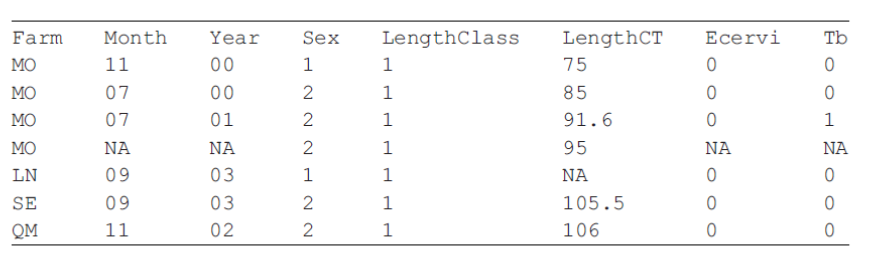

# Import Data into R

## TXT file

```{r}
myc = read.table("example.txt", header=T)
myc
```

## CSV file

```{r}
myc2 = read.csv('example2.csv',header=T)
myc2
```

```{r}
library(tidyverse)
myc3 = read_excel('example2.xlsx', sheet = "example2")
myc3
```

```{r}
library(readxl)
myc4 = read_excel('example2.xlsx', sheet = "Sheet1")
myc4
```

```{r}
excel_sheets('example2.xlsx')
```

## Clipboard

```{r}
read.table(file='clipboard', header=T)
```

# Export Data from R

## Save as TXT file

```{r}
#mydata = data.frame()
#fix(mydata)
write.table(mydata, file='Rdata.txt', col.names=T,row.names=F, sep='\t')
```

## Save as CSV file

```{r}
write.csv(mydata, file='Rdata.csv', row.names=F, col.names=T)
```

## Save clipboard as output

```{r}
write.table(mydata, file='clipboard', col.names=T,row.names=F, sep='\t')
```

Then paste as usual

# Descriptive Statistics



{width="775"}

## Arithmetic Mean

R code : mean(), rowMeans(), colMeans()

```{r}
mean(trees$Girth)
```

```{r}
rowMeans(trees)
```

```{r}
colMeans(trees)
```

## Median

```{r}
median(trees$Height)
```

## Mode

```{r}
x <- c(1,2,2,2,3,4,5,6,7,8,9)
temp<-table(x)
xmode = names(temp[temp==max(temp)])

library(DescTools)
xmode=Mode(x)
```

## Quartiles

```{r}
quantile(trees$Girth, c(0.25,0.75,0.99))
```

```{r}
summary(trees$Girth)
```

# Measures of Variation/Dispertion

## Range

```{r}
range(trees$Girth)
```

## IQR

```{r}
IQR(trees$Girth)
```

## Variance

```{r}
var(trees$Girth)
```

## Standard Deviation

```{r}
sd(trees$Girth)
```

## Coefficient of Variation

$$
CV = (\frac{S}{X})~*~100%
$$

```{r}
sd(trees$Girth)/mean(trees$Girth)*100
```

# Measure of Shape

## Skewness

```{r}
library(e1071)
skewness(trees$Girth)
```

## Kurtosis

-   Kurtosis is based on the size of a distribution's tails.

-   Negative kurtosis (platykurtic) – distributions with short tails.

-   Positive kurtosis (leptokurtic) – distributions with relatively long tails.

```{r}
kurtosis(trees$Girth)
```

# Exercise 1

1.  Read the table batting.history.txt into R. Find the average of PA, AB and H. Create a new data frame consists of the variables Year, Tms, N.Bat, BatAge and the average of PA, AB and H. Export the new data frame into a csv file called BATTING.csv.

```{r}
batting = read.csv('batting.history.txt', header=T, sep='\t')
batting
```

```{r}
newdf = data.frame(
  Year = batting$Year,
  Tms = batting$Tms,
  N.Bat = batting$N.Bat,
  BatAge = batting$BatAge,
  mean_PA_AB_H = rowMeans(batting[7:9])
)
head(newdf)
```

```{r}
write.csv(newdf, file='BATTING.csv', row.names = F, col.names = T)
```

# Simple Data Wrangling

## Head and Tail

```{r}
head(batting,5)
```

```{r}
tail(batting,3)
```

## Which

```{r}
which(mtcars$cyl == 6)
mtcars[which(mtcars$cyl == 6 & mtcars$gear==5),]
```

## Subset

```{r}
subset(mtcars,subset=c(hp<100,cyl>3),select=c(mpg,wt))
```

## Sort

```{r}
sort(mtcars$mpg, decreasing=T)
```

## Order

```{r}
mtcars[order(mtcars$mpg),]
```

## Merge

```{r}
merge(myc2,myc3,by='Name')
```

## Factor

```{r}
num<-c(1,2,2,3,1,2,3,3,1,2,3,3)
fnum<-factor(num)
fnum
```

```{r}
fnum = factor(num,labels=c('I','II','III'), levels=c(1,2,3))
fnum
```

## Table

```{r}
mons <- c("March","April","January","November","January","September",
"October","September", "November","August","January",
"November", "November", "February","May","August","July",
"December","August","August","September","November",
"February","April")
table(mons)
```

```{r}
mons <- factor(mons,levels=c("January","February","March",
"April","May","June","July", "August","September", "October",
"November", "December"), ordered=TRUE)
table(mons)
```

```{r}
names(table(mons))
str(mons)
```

### Cut

```{r}
tweight = cut(women$weight, breaks=3, labels=c('Low','Medium','High'))
table(tweight)
```

```{r}
tweight = cut(women$weight, breaks=c(110,120,140,160,170))
table(tweight)
```

### Interaction

```{r}
table(interaction(mtcars$cyl, mtcars$gear))
```

## Sapply, lapply

apply to column

```{r}
sapply(trees, FUN=median)
```

```{r}
lapply(batting[,7:9], FUN=mean)
```

## Apply

MARGIN=1 apply to each row, MARGIN=2, apply to each column

```{r}
head(apply(batting[,7:9], MARGIN=1,FUN=mean))
```

## do.call

to combine list

```{r}
do.call(c,lapply(trees, FUN=median))
```

## is.na, na.omit

## paste

```{r}
mine<-c("a","b","c")
paste(mine,1:3,collapse="*", sep=':')
```

```{r}
paste0(mine,"!")
```

# Tidyverse

```{r}
library(tidyverse)
```

```{r}
trees %>% 
  select(c(Girth, Height)) %>% 
  arrange(Girth) %>% 
  filter(Girth<10) %>%
  mutate(BG = Girth+100) %>%
  rename(NG=BG) %>%
  pull(NG)
```

# Exercise 2

Use data motor trend car road tests (mtcars) from available data frames in R.

Find the factor for the number of cylinders in the car.

```{r}
factor(mtcars$cyl)
```

Tabulate the percentage for the number of cylinders.

```{r}
table(factor(mtcars$cyl))/length(mtcars$cyl)*100
```

Find the mean, median, first and third quartile as well as the inter-quartile range for the miles per gallon (mpg) of cars observed.

```{r}
c(summary(mtcars$mpg),IQR=IQR(mtcars$mpg))
```

Find the inter-quartile range for the miles per gallon (mpg), displacement (disp), gross horsepower (hp), rear axle ratio (drat), weight (wt) and quarter mile time (qsec) for all the cars.

```{r}
sapply(mtcars[,c(1,3:7)], FUN=IQR)
```

Tabulate factors for the combination of factors for miles per gallon (mpg) and displacement (disp). Create 4 factors for each variable.

```{r}
mpg1 = cut(mtcars$mpg, breaks=4)
disp1 = cut(mtcars$disp, breaks=4)
table(interaction(mpg1,disp1, drop=T))
```

# Exercise 3

Vicente et al. (2006) analysed data from observations of wild boar and red deer reared on a number of estates in Spain. The dataset contains information on tuberculosis (Tb) in both species, and on the parasite Elaphostrongylus cervi, which only infects red deer. In Zuur et al. (2009), Tb was modelled as a function of the continuous explanatory variable, length of the animal, denoted by LengthCT (CT is an abbreviation of cabeza-tronco, which is Spanish for head-body). Tb and Ecervi are shown as a vector of zeros and ones representing absence or presence of Tb and E. cervi larvae. Below, the first seven rows of the spreadsheet containing the deer data are given.



```{r}
data = data.frame(
  Farm = c('MO','MO','MO','MO','LN','SE','QM'),
  Month = c('11','07','07',NA,'09','09','11'),
  Year = c('00','00','01',NA,'03','03','02'),
  Sex = c(1,2,2,2,1,2,2),
  LengthClass = c(1,1,1,1,1,1,1),
  LengthCT = c(75,85,91.6,95,NA,105.5,106),
  Ecervi = c(0,0,0,NA,0,0,0),
  Tb = c(0,0,1,NA,0,0,0)
)
data
```

b\. Find the average length of the animals.

```{r}
mean(data$LengthCT, na.rm=T)
```

c\. Find the number of animals with sex 1 used in the study.

```{r}
nrow(data[data$Sex==1,])

#or

tb1=na.omit(data$Tb)
q4 = length(tb1[tb1==1])
q4
```

d\. How many animals have tuberculosis in both species?

```{r}
nrow(subset(data,subset=c(Tb==1)))
```

e\. Suppose you decide to square root the length of the animals. Add the results to your data.

```{r}
data %>% mutate(SQRT = sqrt(data$LengthCT))
```

f\. Find the mean absolute error (MAE) for the lengths of the animals.

```{r}
data2 = data %>% mutate(diff = abs(data$LengthCT-mean(data$LengthCT, na.rm=T)))
data2

mean(data2$diff, na.rm=T)
```
