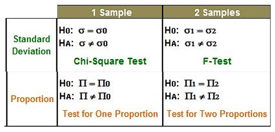
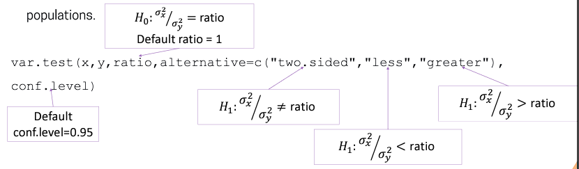

Steps for hypothesis testing ;

1.  Define null and alternative hypothesis; $H_0$ and $H_1$ respectively.

2.  Choose a suitable test and select $\alpha$

3.  Compute test statistic

4.  Make a statistical decision based on p-value/critical value;

    -   Reject $H_0$ and accept $H_1$ if p-value smaller than significant level. This indicates there is evidence against null hypothesis.

    -   Fail to rejecct $H_0$ if p-value is bigger than significance level. This indicates there is not enough evidence against null hypothesis


# Z test in R


```{r}
library(TeachingDemos)
x <- rnorm(100, mean=2, sd=0.5)
z.test(x,mu=2, stdev=0.5, alternative="two.sided")
```

# One Sample t-test

Perform a test for a population mean of small (normally distributed) sample


```{r}
x <- rnorm(20, mean=1, sd=0.5)
t.test(x, mu=2, alternative='less')
```

# Two Sample t-test

To test the difference in population means of two independent small (normally distributed) samples.


```{r}
x<-c(1.3,1.5,1.2,1.7,1.3) 
y<-c(1.6,1.7,1.8,1.6,1.5)
t.test(x,y,mu=0, alternative='less', var.equal=T)
```

# Paired Sample t-test

To test the difference in population means for two paired samples (differences normally distributed).


```{r}
t.test(x,y,mu=0,alternative = 'less',var.equal = T,paired = T)
```

# ANOVA

Basic framework;

1.  A test used to determine differences between research results from three or more unrelated samples/groups.

2.  Want to study the effect of one or more qualitative variable on a quantitative outcome.

3.  Qualitative variables -\> factors.

4.  Assumptions;

    -   Normality

    -   Equal Variance

    -   Independent Samples

## Null Hypothesis

$$
H_0:\mu_1=\mu_2=~...~=\mu_k
$$

## Alternative Hypothesis

$$
H_1:\mu_i\not=\mu_j,~(for~some~i~and~j)
$$

## Anova partition

1.  Variation within levels/groups.

2.  Variation between levels/groups.

## ANOVA in R

Utilizer the `aov()` function.

### One-way ANOVA:

```{r}
library(lattice)
one.way <- aov(yield~variety, data=barley)
summary(one.way)
```

### Two-way ANOVA:

```{r}
two.way <- aov(yield~variety+site, data=barley)
summary(two.way)
```

### Two-way ANOVA with interaction effect:

```{r}
interaction <- aov(yield~variety*site, data=barley)
summary(interaction)
```

# Hypothesis Testing for Proportions and Standard Deviations



## One Sample Test for Proportions

`prop.test()` will perform test for a population proportion for a large sample (\<10 success and failures).


```{r}
prop.test(52,100,p=0.4,alternative='greater')
```

## Two Sample Test for Proportions

`prop.test()` will also perform test for difference in population proportions for 2 independent large samples (\>= 10 success and failures).


```{r}
prop.test(c(132,135), c(400,390), alternative='two.sided', correct=F)
```

# Chi-square Test


```{r}
library(EnvStats)
data<-c(12.43, 11.71, 14.41, 11.05, 9.53, 11.66, 9.33,11.71,14.35,13.81)
varTest(data, alternative = 'greater',sigma.squared = 2.25)
```

# Equality of Variance Test

`var.test()` function will test for the equality of variance for samples from two normal populations.



```{r}
var.test(x,y,alternative = 'two.sided')
```

# Linear Regression

Statistical method used to:

1.  Study relationship among variables

2.  Forecast/predict values

Steps for Regression Analysis:

1.  Check linear/non-linear relationship

2.  Predict parameter using linear regression

3.  Check suitability of the model build based on the data collected

4.  Makes predictions

## Simple Linear Regression

$$
y_i=\beta_0+\beta_ix_i \newline H_0:\beta_0=0 \newline H_1:\beta_1 \not= 0
$$

Fail to reject $H_0$ is equivalent to concluding that there is no proof that there is no linear relationship between X and Y.

F-test for regression model (ANOVA test for regression) can also be used to test the significance of model.

Coefficient of determination (R^2^) is used to judge adequacy of regression model.

-   Measures the proportionate reduction in the total variation of Y associated with the introduction of X. Hence, the proportion of total variation in Y which have been explained by X.

```{r}
eruption.lm <- lm(eruptions~waiting, data=faithful)
summary(eruption.lm)
```

```{r}
plot(eruptions~waiting, data=faithful, main='Plot of Y vs X')
abline(eruption.lm, col='red',lty='dotted')
```

## Multiple Linear Regression

The usage of adjusted 𝑅2 (𝑅𝐴2) is preferable since its value will only increase if the inclusion of the new variable is able to reduce the Mean Squared Error (MSE). 

```{r}
pairs(~stack.loss+Air.Flow+Water.Temp+Acid.Conc., data=stackloss)
```

```{r}
stackloss.lm <- lm(stack.loss~ Air.Flow + Water.Temp + Acid.Conc., data=stackloss) 
summary(stackloss.lm)
```


# Exercise

## One sample t-test

1.  A fisherman breeds red tilapias in a pond in Sungai Terengganu. He claims that the mean weight of the red tilapias exceeds 1.2 kg. Assume that the weight of the population of red tilapias is approximated normal. A random sample of 5 red tilapias was taken from his pond, and their weights were 1.1, 1.2, 1.3, 1.2 and 1.4 kg, respectively. Test at 𝛼 = 0.05 whether the fisherman’s claim is reasonable.

$$
H_0 : \mu = mu
\newline
H_1 : \mu > mu
$$

```{r}
library(TeachingDemos)
pop_mean = 1.2
sample = c(1.1,1.2,1.3,1.2,1.4)
n = 5

t.test(sample, mu=pop_mean, alternative='greater')
```

p-value \> $\alpha$. Therefore, failed to reject $H_0$, there is not enough evidence to reject that the mean weight of the red tilapias is 1.2kg.

## Two Sample Test of Proportions

2.  For 80 randomly selected men, 30 regularly bicycled to campus; while for 100 randomly selected women, 20 regularly bicycled to campus. Test 𝐻0: 𝑝1 = 𝑝2 vs. 𝐻1: 𝑝1 \> 𝑝2 at 0.05 level of significance.

$$
H_0 : p1 = p2
\newline
H_1 : p1 > p2
$$

```{r}
prop.test(c(30,20), c(80,100), alternative='greater', correct=F)
```

p-value \< $\alpha$. Therefore, there is enough evidence to reject $H_0$, there is enough evidence to reject that the proportion of men who regularly cycle to campus is equal to women.

## One-way ANOVA

3.  The `PlantGrowth` dataset are results from an experiment on the growth of plants with different treatments. A researcher wants to know if the average weights of the plants in the three experimental circumstances vary significantly. Perform a test to find out the answer for him.

$$
H_0 : \mu_1 = \mu_2 = \mu_3
\newline
H_1 : \mu_i \not= \mu_j,~ (for~some~i~and~j)
$$

```{r}
data("PlantGrowth")
str(PlantGrowth)

one.way = aov(weight~group, data=PlantGrowth)
summary(one.way)
```

p-value \< $\alpha$. Therefore, there is enough evidence to reject $H_0$. There is enough evidence to reject that all the means between groups is the same.

## 

4.  Based on the `Salaries` dataset in the car package, build a simple linear model for the salaries of professors against the years of service, i.e `salary` as the dependent variable and `yrs.service` as the independent variable. Then build a multiple linear regression with an additional independent variable of `yrs.since.phd` and a dummy variable model with both `yrs.service` and `rank` as independent variables. Write down the equation for the 3 models and compare them.

```{r}
library(carData)
data(Salaries)
str(Salaries)
```

Model 1

```{r}
lm1 = lm(salary ~ yrs.service, data = Salaries)
summary(lm1)
```

Model 2

```{r}
lm2 = lm(salary ~ yrs.service + yrs.since.phd, data=Salaries)
summary(lm2)
```

Model 3

```{r}
lm3 = lm(salary ~ yrs.service + rank, data=Salaries)
summary(lm3)
```
