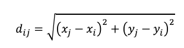
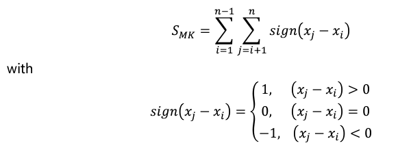
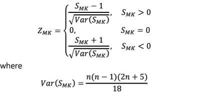

# IF Statement

``` r
if (test_expression) {
  statement
}
```

```{r}
x = 5
if (x > 0) {
  print("x is positive")
}
```

# IF ELSE Statement

``` r
if (test_expression) {
  statement1
} else  {}     #-- else part is optional, must be same line as closing bracket of if
  statement2
}
```

```{r}
x=-3
if (x>=0) {
  print('x is non-negative')
} else {
  print('x is negative')
}
```

# IF... ELSE IF statement

``` r
if (test_expression1) {
  statement1
} else if (test_expression2) {      #-- else part is optional, must be same line as closing bracket of if
  statement2
} else if (test_expression3) (
  statement3
) else          #-- last else no need for {}
  statement4
```

# IFELSE Statement

``` r
  ifelse(test_expression, x, y)
```

```{r}
ifelse(x>=0, 'x is non negative', 'x is negative')
```

# R Switch Statement

```{r}
x = 3
switch(x, 'one', 'two', 'three', 'four')
```

# For Statement

``` r
for (value in sequence) {
  statement
}
```

```{r}
square.it <- function(x){
  square <- x*x
  return(square)
}
#
```

```{r}
my.fun <- function(X.matrix , y.vec , z.scalar) {
  #use previous function
  sq.scalar <- square.it(z.scalar)
  mult <- X.matrix %*% y.vec
  Final<-  mult*sq.scalar
  return(Final)
}

my.mat <- cbind(c(1,2,3),c(3,4,5))
my.vec <- c(5,6)
my.fun(X.matrix=my.mat , y.vec=my.vec , z.scalar=9)
```

# Exercise

## 1. Write a function that computes the coefficient of variation and plot the histogram of a vector.

```{r}
hist_cov = function (x) {
  cv = sd(x)/mean(x) * 100
  hist(x, main = paste("The coefficient of variation is", cv))
}
set.seed(10)
hist_cov(runif(20,1,10))
```

## 2. Suppose a researcher obtained the coordinates of n points and wish to find the maximum distance between two points from all the different pairs of points possible, produce an R function which helps to find the maximum distance between the coordinates of one particular point, (𝑥𝑖, 𝑦𝑖), with the coordinates of the other (n–1) points. The distance, d, between coordinates of points i and j, can be calculated as follows:



```{r}
max_distance <- function (point, other_points) {
  x_i = point[1]
  y_i = point[2]
  
  distance <- sqrt((other_points[,1] - x_i)^2 + (other_points[,2] - y_i)^2)
  
  return(max(distance))
}

# Matrix of other points (n-1 points)
points <- matrix(runif(30,1,15), 
                       ncol = 2, byrow = TRUE)

# Calculate the maximum distance
max_distance(points[3,], points)
```

## 3. Mann-Kendall test is a statistical test used to determine the existence of monotonic trend in a data set X.

### a) Write an R function that computes the test statistic, SMK, of the Mann-Kendall test for a data set X of size n which is given as follows:



```{r}
Df <- function (i,x) {
  n <- length(x)
  j <- (i+1):n
  y <- x[j] - x[i]
  return(y)
}

Smk <- function(x) {
  n <- length(x)
  i <- 1:(n-1)
  s <- do.call(c,lapply(i,function(i) Df(i,x)))
  s[s<0] <- -1
  s[s==0] <- 0
  s[s>0] <- 1
  smk <- sum(s)
  return(smk)
}
Smk(x)
```

### b) If X is a series with no tie values, then the standardized test statistic, ZMK, is written as:



Write an R function which calls the function in (a) to get the value of SMK and then compute and return the value of ZMK.

```{r}
zmk <- function(x) {
  n = length(x)
  
  var_smk = (n*(n-1)*(2*n+5))/18
  
  smk = smk_function(x)
  if (smk>0) {
    zmk = (smk-1)/sqrt(var_smk)
  } else if(smk<0) {
    zmk = (smk+1)/sqrt(var_smk)
  } else
    zmk = 0
  return(zmk)
}

zmk(x)
```
