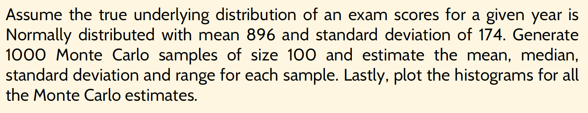

```{r}
rnorm(1000, mean=10, sd=4)
hist(rnorm(1000, mean=10, sd=4))
```

```{r}
rbinom(6,size=1,prob=0.5)

```

```{r}
hist(runif(50,min=0,max=100), breaks=15, main='histogram')
```

# Monte Carlo Simulation



```{r fig.height=8, fig.width=8}
m <-1000
n <-100
x <-matrix(rnorm((m*n),896,174), nrow=m)
means <-apply(x,MARGIN=1,FUN=mean)
sdevs<-apply(x,MARGIN=1,FUN=sd)
medians <-apply(x,MARGIN=1,FUN=median)
ranges <-apply(apply(x,MARGIN=1,FUN=range),MARGIN=2,FUN=diff)

par(mfrow=c(2,2)) # Creates a 2x2 graphics window.
hist(means,xlab="Means",ylab="Frequency", main="Monte Carlo Means",cex.axis=1.5,cex.lab=1.6,cex.main=1.6)
hist(sdevs,xlab="Std. Deviations",ylab= "Frequency",main="Monte Carlo Std.Deviations",cex.axis=1.5,cex.lab=1.6,cex.main=1.6)
hist(medians,xlab="Medians",ylab="Frequency", main="Monte Carlo Medians",cex.axis=1.5,cex.lab=1.6,cex.main=1.6)
hist(ranges,xlab="Ranges",ylab="Frequency", main="Monte Carlo Ranges",cex.axis=1.5,cex.lab=1.6,cex.main=1.6)
```

# Exercise

## 1. The approximation of π=3.1416 can be approximated by random sampling of a unit disc. By computing random points in a square and determining how many of these points are in the circle, a Monte Carlo simulation can be used to approximate π. This approximation relies on the ratio, *p*, of the area of the unit disc to the area of the square where the length of each side of the square is equal to the diameter of the unit circle. Hence, the estimation of π is as follows:

$$
\pi =4p
$$

Perform the Monte Carlo simulation and see how the estimate for π improves with increasing *n*. Compute the deviation from the exact result, $|~\pi~-~\hat\pi~|$.(Plot the estimates and the deviations)

```{r}
library(tidyverse)
pai <- function(a) {
  estimates = 1:a
  for (i in 1:a) {
    x <- runif(i, min=-1,max=1)
    y <- runif(i, min=-1, max=1)
    points = data.frame(x,y)
    df <- points %>% 
      mutate(x2 = x^2) %>% 
      mutate(y2 = y^2) %>% 
      mutate(loc = (x2+y2))

    points_in_circle <- length(df[df$loc <= 1,3])
    P = points_in_circle/nrow(points)
    pai <- 4*P
    estimates[i] = pai
  }
  df2 = data.frame(
    n = 1:a,
    pi = rep(3.1416, a),
    estimate = estimates
  )
  df2 <- df2 %>% mutate(deviation = abs(pi-estimate))
  return(df2)
}

data = pai(1000)
par(mfrow=c(1,2))
plot(data$n, data$deviation)
plot(data$n, data$estimate, col='blue');abline(h=3.1416,col='red',lty='dashed')
```

## 2. Let $Y_1, Y_2, ... Y_n$ be a random sample from a normal distribution. Compare three estimators for the mean µ of the distribution;

i)  Sample mean

ii) Sample 20% trimmed mean (R code: mean(x, trim=0.2))

iii) Sample median

Perform a Monte Carlo simulation and compute the bias of each estimator.

```{r}
estimator <- function(n) {
  samp <- rnorm(n)
  S_mean <- mean(samp)
  S_20mean <- mean(samp, trim=0.2)
  S_med <- median(samp)
  results <- c(S_mean, S_20mean, S_med)
  names(results) <- c("mean","trimmed","median")
  return(results)
}

m <- 1000
n <- 100
mu <- 3
sd <- 2


x <- matrix(rnorm((m*n), mu, sd), ncol=m)
est <- apply(x,MARGIN=2, FUN=estimator)
bias<- abs(mu-est)
rowMeans(est)
rowMeans(bias)
```

## 3. Central Limit Theorem

In [probability theory](https://en.wikipedia.org/wiki/Probability_theory "Probability theory"), the **central limit theorem** (**CLT**) states that, given certain conditions, the [arithmetic mean](https://en.wikipedia.org/wiki/Arithmetic_mean "Arithmetic mean") of a sufficiently large number of iterates of [independent](https://en.wikipedia.org/wiki/Statistical_independence "Statistical independence") [random variables](https://en.wikipedia.org/wiki/Random_variables "Random variables"), each with a well-defined [expected value](https://en.wikipedia.org/wiki/Expected_value "Expected value") and well-defined [variance](https://en.wikipedia.org/wiki/Variance "Variance"), will be approximately [normally distributed](https://en.wikipedia.org/wiki/Normal_distribution "Normal distribution"), regardless of the underlying distribution.

Use Monte Carlo simulation to check the distributional assumption of this theorem. Use histograms to check for normality

```{r}
clt <- function(m,n) {
  x_norm <- matrix(rnorm((m*n)), nrow=m)
  x_exp <- matrix(rexp((m*n), rate=1), nrow=m)
  x_chisq <- matrix(rchisq((m*n), df=n-1), nrow=m)
  x_unif <- matrix(runif((m*n)), nrow=m)
  
  meansx1 <-apply(x_norm,MARGIN=1,FUN=mean)
  meansx2 <-apply(x_exp,MARGIN=1,FUN=mean)
  meansx3 <-apply(x_chisq,MARGIN=1,FUN=mean)
  meansx4 <-apply(x_unif,MARGIN=1,FUN=mean)
  
  par(mfrow=c(2,2))
  hist(meansx1, main='normal')
  hist(meansx2, main='exponential')
  hist(meansx3, main='chi-sq')
  hist(meansx4, main='uniform')
  
}

clt(100,1000)
```

```{r}
hist(rexp(1000))
```
